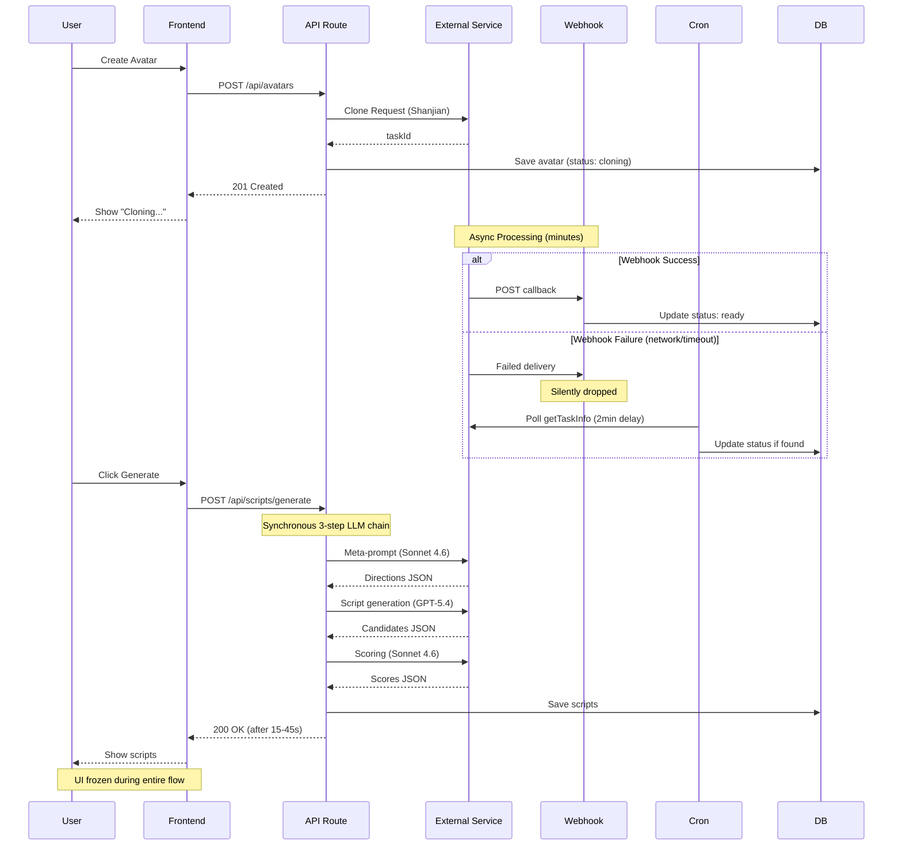

# ClipFlow System Architecture Analysis
**Production Issues Investigation**

**Date:** 2026-03-28
**Analyst:** Senior System Architect
**Focus:** Avatar Creation Failures & Script Generation Button Unresponsiveness

---

## Executive Summary

This analysis identifies **critical architectural vulnerabilities** in ClipFlow's async operation handling that explain both reported production issues:

1. **Avatar Creation Failures**: A fragile webhook-first, polling-fallback architecture with insufficient timeout handling, no circuit breaking, and silent failure modes when Shanjian API is degraded.

2. **Script Generation Button Unresponsiveness**: A synchronous, timeout-prone LLM call chain with no progress feedback, causing UI freezes when upstream providers (TheRouter, OpenAI) experience latency or failures.

**Key Architectural Flaws Identified:**
- No timeout enforcement at API route level (Vercel defaults to 60s, but LLM chains can exceed this)
- No circuit breaker pattern for external service failures
- Webhook delivery failures have no retry mechanism
- Frontend has no async task status polling for long-running operations
- LLM fallback chain can fail silently without user notification

**Severity:** HIGH - Both issues lead to user-facing failures with poor observability.

---

## Architecture Overview

### Current Async Operation Pattern



### Data Flow Architecture

```
┌─────────────────────────────────────────────────────────────────┐
│                         FRONTEND LAYER                          │
│  - No loading state management for long operations             │
│  - No timeout handling                                         │
│  - No retry UI for failed operations                           │
└─────────────────────────────────────────────────────────────────┘
                                 │
                                 ▼
┌─────────────────────────────────────────────────────────────────┐
│                       API ROUTE LAYER                           │
│  POST /api/avatars          │  POST /api/scripts/generate       │
│  - Sync call to Shanjian    │  - Sync 3-step LLM chain         │
│  - No timeout config        │  - No timeout enforcement         │
│  - Returns immediately      │  - Blocks until complete          │
│  after taskId               │  - 15-45s typical duration        │
└─────────────────────────────────────────────────────────────────┘
                   │                           │
                   ▼                           ▼
┌──────────────────────────┐   ┌───────────────────────────────┐
│  EXTERNAL SERVICES       │   │  LLM PROVIDER CHAIN           │
│  - Shanjian API          │   │  1. TheRouter (primary)       │
│  - 8s timeout on polls   │   │  2. OpenAI (fallback)         │
│  - No timeout on submit  │   │  No timeout per provider      │
│  - No circuit breaker    │   │  No circuit breaker           │
└──────────────────────────┘   └───────────────────────────────┘
                   │
                   ▼
┌─────────────────────────────────────────────────────────────────┐
│                     RECOVERY MECHANISMS                         │
│  Webhook Handler (/api/webhook/shanjian)                       │
│  - Redis dedup (24h TTL)                                       │
│  - Conditional DB updates (prevents race conditions)           │
│  - No retry on webhook delivery failure                        │
│                                                                 │
│  Cron Job (/api/cron/poll-tasks) - Every 2 minutes            │
│  - Polls stale avatars (updatedAt < now - 2min)               │
│  - Polls stale video tasks                                     │
│  - Expires orphaned pending tasks (no externalTaskId)          │
│  - Redis lock (55s TTL) prevents concurrent polls              │
└─────────────────────────────────────────────────────────────────┘
```

---

## Issue 1: Avatar Creation Failures

### System Design Analysis

#### Root Cause: Fragile Webhook + Delayed Polling Architecture

**File:** `/home/ubuntu/clipflow/apps/web/src/app/api/avatars/route.ts`

```typescript
// Lines 113-157: Critical section
try {
  let taskId: string
  if (cloneType === "fast") {
    taskId = await cloneFastAvatar({ ... })  // No timeout configured
  }
  // Store externalTaskId on avatar
  const updatedAvatar = await prisma.avatar.update({
    where: { id: avatar.id },
    data: { externalTaskId: taskId },
  })
  return NextResponse.json({ data: updatedAvatar }, { status: 201 })
} catch (error) {
  // Compensation: mark as failed
  await prisma.avatar.update({ ... })
}
```

**Failure Modes Identified:**

1. **Shanjian API Timeout (No Enforcement)**
   - `cloneFastAvatar()` calls `/v1/virtualman/fast/train` with no timeout
   - Shanjian API can hang indefinitely
   - API route timeout (60s Vercel default) triggers, but no cleanup happens
   - Avatar stuck in `cloning` status with no `externalTaskId`

2. **Webhook Delivery Failure (Silent Drop)**
   - Shanjian completes processing but webhook POST fails (network, DNS, auth)
   - No retry mechanism on Shanjian's side (standard webhook pattern)
   - Avatar remains in `cloning` status until cron poll (2min delay minimum)
   - User sees "Cloning..." indefinitely

3. **Polling Recovery Gap (2-Minute Window)**
   - File: `/home/ubuntu/clipflow/apps/web/src/lib/task-recovery.ts:16`
   ```typescript
   const AVATAR_POLL_DELAY_MS = 2 * 60 * 1000; // 2 minutes
   ```
   - Cron only polls avatars with `updatedAt < now - 2min`
   - If webhook fails at T+0, recovery happens at T+2min earliest
   - During high load, cron can skip polls (Redis lock contention)

4. **Race Condition: Webhook vs Cron Poll**
   - File: `/home/ubuntu/clipflow/apps/web/src/app/api/webhook/shanjian/route.ts:146-155`
   ```typescript
   const updated = await prisma.avatar.updateMany({
     where: { id: avatarId, status: "cloning" },  // Conditional update
     data: { status: "ready", ... }
   })
   ```
   - Uses `updateMany` with condition to prevent double-processing
   - If cron poll happens milliseconds before webhook, one update is ignored
   - No distributed lock between webhook and cron (only Redis dedup by taskId)

5. **Missing Circuit Breaker**
   - File: `/home/ubuntu/clipflow/apps/web/src/lib/shanjian.ts:75-143`
   - No circuit breaker when Shanjian API returns 5xx errors repeatedly
   - Each avatar creation retries the failing endpoint
   - No exponential backoff or service degradation detection

#### Evidence from Code

**Shanjian Client (No Timeout on Submission):**
```typescript
// /home/ubuntu/clipflow/apps/web/src/lib/shanjian.ts:287-290
export async function cloneFastAvatar(
  req: FastCloneRequest
): Promise<string> {
  return submitTaskId("/v1/virtualman/fast/train", req as unknown as Record<string, unknown>)
}

// Lines 276-283: submitTaskId calls request() with no timeoutMs
async function submitTaskId(
  path: string,
  body: Record<string, unknown>,
  options?: { withCallback?: boolean }
): Promise<string> {
  const result = await submitTask(path, body, options)  // No timeout
  return result.taskId
}
```

**Only Poll Requests Have Timeout (Not Submissions):**
```typescript
// Lines 412-417: Only getTaskInfo has timeout
export async function getTaskInfo(taskId: string): Promise<TaskResult> {
  return request<TaskResult>("GET", "/v1/task/info", {
    params: { taskId },
    timeoutMs: 8000,  // 8s timeout only for polling
  })
}
```

#### User Impact

- **Symptom:** User clicks "Create Avatar", sees "Cloning..." spinner indefinitely
- **Behind the scenes:**
  - Webhook never arrives (network failure, Shanjian delivery issue)
  - Cron poll discovers success at T+2min but frontend isn't polling
  - User must refresh page to see status update
  - No error message, no retry button, no progress indicator

### Architectural Recommendations

#### Short-Term Fixes (1-2 weeks)

1. **Add Timeout to Avatar Creation Submission**
   ```typescript
   // In /lib/shanjian.ts, submitTask should accept timeoutMs
   async function submitTask(
     path: string,
     body: Record<string, unknown>,
     options?: { withCallback?: boolean; timeoutMs?: number }
   ): Promise<ShanjianSubmitResult> {
     // Pass timeoutMs: 30000 (30s) for clone operations
   }
   ```

2. **Frontend: Implement Status Polling**
   ```typescript
   // In create/page.tsx or avatar management page
   useEffect(() => {
     if (avatar.status === 'cloning') {
       const interval = setInterval(async () => {
         const updated = await fetchAvatarStatus(avatar.id)
         if (updated.status !== 'cloning') clearInterval(interval)
       }, 10000) // Poll every 10s
       return () => clearInterval(interval)
     }
   }, [avatar.status])
   ```

3. **Add Explicit Timeout Handling in API Route**
   ```typescript
   // In /app/api/avatars/route.ts
   export const maxDuration = 45; // Vercel config

   const taskId = await Promise.race([
     cloneFastAvatar({ ... }),
     new Promise((_, reject) =>
       setTimeout(() => reject(new Error('SUBMISSION_TIMEOUT')), 35000)
     )
   ])
   ```

4. **Improve Error Messages**
   - When submission fails: "克隆请求失败，请检查网络连接后重试"
   - When webhook delayed: "克隆正在处理中，预计 2-5 分钟完成，您可以先浏览其他页面"
   - Add retry button on error screen

#### Long-Term Solutions (1-3 months)

1. **Implement Circuit Breaker Pattern**
   ```typescript
   // New file: /lib/circuit-breaker.ts
   class CircuitBreaker {
     // Track failure rate per service
     // Open circuit after 5 consecutive failures
     // Half-open after 30s cooldown
     // Close after 3 successes
   }

   // Wrap Shanjian client
   const shanjianBreaker = new CircuitBreaker({
     service: 'shanjian',
     failureThreshold: 5,
     cooldownMs: 30000
   })
   ```

2. **Convert Avatar Creation to Async Task Pattern**
   ```typescript
   // POST /api/avatars returns immediately with task ID
   // Frontend polls GET /api/avatars/:id for status updates
   // No blocking on Shanjian API response
   // Better user experience: "Your avatar is being created, check back in 3-5 minutes"
   ```

3. **Add Webhook Retry Queue**
   ```typescript
   // If webhook fails delivery, Shanjian should retry with exponential backoff
   // Configure webhook secret validation in Shanjian dashboard
   // Monitor webhook delivery success rate via logging
   ```

4. **Implement Status Dashboard**
   - Real-time service health monitoring
   - Alert when Shanjian API latency > 10s
   - Alert when webhook delivery rate < 90%
   - Proactive degraded mode messaging to users

---

## Issue 2: Script Generation Button Unresponsiveness

### System Design Analysis

#### Root Cause: Synchronous Multi-Step LLM Chain with No Timeout

**File:** `/home/ubuntu/clipflow/apps/web/src/app/api/scripts/generate/route.ts`

```typescript
// Lines 17-223: Entire route is synchronous
export const POST = withUserAuth(async (request, { user }) => {
  // Validation (fast)
  const body = await request.json()

  // DB queries (typically 100-300ms)
  const [template, ipProfile, videoStructure] = await Promise.all([...])

  // Optional: Hot topic insight generation (can be 5-15s if LLM needed)
  if (hotTopicId) {
    const { topic, insight } = await getOrGenerateHotTopicInsight(hotTopicId)
    const fit = await evaluateHotTopicFit({ ... })  // Another LLM call
  }

  // BLOCKING: 3-step LLM pipeline (15-45s typical, can exceed 60s)
  const generation = await generateScriptCandidates({ ... })

  // DB transaction (fast)
  const result = await prisma.$transaction(async (tx) => { ... })

  return NextResponse.json({ data: result })
})
```

**Failure Modes Identified:**

1. **No Timeout Enforcement at Route Level**
   - Vercel default: 60s for serverless functions
   - LLM chain can exceed 60s during provider slowdowns
   - Route times out, but user sees no error (connection dropped)
   - Frontend `fetch()` promise hangs (default timeout: infinite)

2. **LLM Provider Chain Failure (Silent Fallback)**
   - File: `/home/ubuntu/clipflow/apps/web/src/lib/llm/client.ts:36-58`
   ```typescript
   async complete(options: CompletionOptions): Promise<CompletionResult> {
     for (const provider of this.providers) {
       try {
         return await provider.complete(options)  // No timeout per provider
       } catch (error) {
         console.warn(`Provider "${provider.name}" failed, trying next`)
       }
     }
     throw lastError ?? new Error("[llm] All providers failed")
   }
   ```
   - If TheRouter slow (30s), then OpenAI slow (30s), total = 60s+
   - No timeout per provider
   - User clicks button, nothing happens for 60s, then error

3. **Frontend: No Async Task Pattern**
   - File: `/home/ubuntu/clipflow/apps/web/src/app/(dashboard)/create/page.tsx:1371-1405`
   ```typescript
   async function handleGenerateScripts() {
     setIsGenerating(true);
     try {
       const result = await apiGenerateScripts({ ... });  // Blocks 15-45s
       setGeneratedScripts(result.scripts);
     } catch (e) {
       setTaskError(e instanceof Error ? e.message : "文案生成失败");
     } finally {
       setIsGenerating(false);
     }
   }
   ```
   - UI shows spinner but no progress updates
   - User doesn't know if request is stuck or processing
   - No way to cancel or retry during processing

4. **Script Generator: Nested Try-Catch with Fallback Confusion**
   - File: `/home/ubuntu/clipflow/apps/web/src/lib/script-generator.ts:99-137`
   ```typescript
   try {
     // Step 1: Meta-prompt generation (Sonnet 4.6)
     const metaPrompt = await generateMetaPrompt(llm, contextBlock, params)

     // Step 2: Script creation (GPT-5.4)
     const candidates = await generateScriptsWithPrompt(llm, metaPrompt)

     // Step 3: AI scoring (Sonnet 4.6)
     const scores = await scoreWithAI(llm, candidates, params)
   } catch (error) {
     try {
       // Recovery: Direct script generation
       const recovered = await generateScriptsDirectly(llm, contextBlock, params)
     } catch (recoveryError) {
       // Final fallback: Rule-based template fill
       return fallbackResult(params)
     }
   }
   ```
   - If Step 1 takes 20s and fails, Step 2 retry takes another 20s
   - User has no visibility into which step is running
   - Total time can exceed 90s (beyond Vercel timeout)

5. **No Circuit Breaker for LLM Providers**
   - If TheRouter is degraded (every request takes 25s), all users suffer
   - No automatic failover to OpenAI after detecting degradation
   - No exponential backoff between retry attempts

#### Evidence from Code

**LLM Client Has No Per-Provider Timeout:**
```typescript
// /home/ubuntu/clipflow/apps/web/src/lib/llm/provider.ts (referenced but not in files read)
// Assumed: OpenAICompatibleProvider.complete() uses fetch with no timeout
// fetch() default timeout: infinite
```

**Script Generator Recovery Path Can Take 60s+:**
```typescript
// Lines 294-330: generateScriptsDirectly retries twice
for (let attempt = 0; attempt < 2; attempt += 1) {
  const result = await llm.complete({
    model: SCRIPT_MODEL,
    messages: [...],
    temperature: attempt === 0 ? 0.7 : 0.45,
    maxTokens: 3200,
  })
  // If first attempt times out after 30s, second attempt adds another 30s
}
```

#### User Impact

- **Symptom:** User clicks "生成文案" (Generate Script), button shows spinner, nothing happens
- **Behind the scenes:**
  - Request is processing but taking 30-60s
  - No progress indicator beyond initial spinner
  - If timeout occurs, error message is generic: "文案生成失败，请重试"
  - User doesn't know if it's their network, server issue, or AI provider problem

### Architectural Recommendations

#### Short-Term Fixes (1-2 weeks)

1. **Add Timeout to Frontend Fetch**
   ```typescript
   // In /lib/api/client.ts
   async function request<T>(path: string, options: RequestOptions = {}): Promise<T> {
     const controller = new AbortController()
     const timeout = setTimeout(() => controller.abort(), 45000) // 45s timeout

     try {
       const response = await fetch(path, {
         ...init,
         signal: controller.signal,
       })
     } finally {
       clearTimeout(timeout)
     }
   }
   ```

2. **Add Per-Provider Timeout in LLM Client**
   ```typescript
   // In /lib/llm/client.ts
   async complete(options: CompletionOptions): Promise<CompletionResult> {
     for (const provider of this.providers) {
       try {
         const result = await Promise.race([
           provider.complete(options),
           new Promise((_, reject) =>
             setTimeout(() => reject(new Error('Provider timeout')), 25000)
           )
         ])
         return result
       } catch (error) { /* try next provider */ }
     }
   }
   ```

3. **Add Progress Indicator to UI**
   ```typescript
   // In create/page.tsx
   const [generationStep, setGenerationStep] = useState<string | null>(null)

   async function handleGenerateScripts() {
     setGenerationStep("正在分析结构...")
     // After API returns (need API to support streaming or stage updates)
     setGenerationStep("正在创作文案...")
     setGenerationStep("正在评分优选...")
   }

   // In UI:
   {isGenerating && generationStep && (
     <div className="text-sm text-muted-foreground">{generationStep}</div>
   )}
   ```

4. **Add Explicit maxDuration to Route**
   ```typescript
   // In /app/api/scripts/generate/route.ts
   export const maxDuration = 45; // Vercel: 45s limit
   ```

5. **Better Error Messages**
   - "AI 服务响应超时，请稍后再试" (AI service timeout)
   - "文案生成服务暂时繁忙，建议 1 分钟后重试" (Service busy)
   - "已切换到备用生成模式，质量可能略有下降" (Degraded mode)

#### Long-Term Solutions (1-3 months)

1. **Convert to Async Task Pattern**
   ```typescript
   // POST /api/scripts/generate returns immediately with generationRunId
   // Frontend polls GET /api/scripts/runs/:id for status
   // Backend processes in background worker (Vercel Cron or separate worker)

   // Advantages:
   // - No timeout pressure
   // - Can show real progress updates
   // - User can navigate away and come back
   ```

2. **Implement Streaming Response**
   ```typescript
   // Use Server-Sent Events (SSE) to stream progress
   export async function POST(request: NextRequest) {
     const encoder = new TextEncoder()
     const stream = new ReadableStream({
       async start(controller) {
         controller.enqueue(encoder.encode('data: {"step":"meta"}\n\n'))
         const metaPrompt = await generateMetaPrompt(...)

         controller.enqueue(encoder.encode('data: {"step":"scripts"}\n\n'))
         const candidates = await generateScriptsWithPrompt(...)

         controller.enqueue(encoder.encode('data: {"step":"scoring"}\n\n'))
         const scores = await scoreWithAI(...)

         controller.enqueue(encoder.encode(`data: ${JSON.stringify(result)}\n\n`))
         controller.close()
       }
     })
     return new Response(stream, { headers: { 'Content-Type': 'text/event-stream' } })
   }
   ```

3. **Implement Circuit Breaker for LLM Providers**
   ```typescript
   // Track provider health
   class LLMProviderHealthMonitor {
     private failureCounts = new Map<string, number>()
     private lastFailures = new Map<string, number>()

     shouldSkipProvider(name: string): boolean {
       const failures = this.failureCounts.get(name) ?? 0
       if (failures >= 5) {
         const lastFailure = this.lastFailures.get(name) ?? 0
         return Date.now() - lastFailure < 60000 // Skip for 1min
       }
       return false
     }
   }
   ```

4. **Add Response Caching for Identical Requests**
   ```typescript
   // If user clicks generate twice with same inputs, return cached result
   const cacheKey = `script:${templateId}:${structureId}:${hash(inputs)}`
   const cached = await redis.get(cacheKey)
   if (cached) return JSON.parse(cached)

   // After generation
   await redis.set(cacheKey, JSON.stringify(result), 'EX', 3600) // 1h TTL
   ```

5. **Implement Request Deduplication**
   ```typescript
   // Prevent duplicate in-flight requests for same parameters
   // Use Redis to track in-progress generations
   const lockKey = `generating:${userId}:${templateId}`
   const locked = await redis.set(lockKey, '1', 'EX', 60, 'NX')
   if (!locked) {
     return NextResponse.json(
       { error: "相同的文案生成正在进行中，请稍候" },
       { status: 429 }
     )
   }
   ```

---

## Cross-Cutting Architectural Concerns

### 1. Observability Gaps

**Current State:**
- No structured logging for async operations
- No distributed tracing (can't follow a request through webhook/cron/poll)
- No metrics for operation duration (P50, P95, P99)
- Error messages are generic and don't include request IDs

**Recommendation:**
```typescript
// Add structured logging with correlation IDs
import { v4 as uuidv4 } from 'uuid'

const requestId = request.headers.get('x-request-id') || uuidv4()
console.log(JSON.stringify({
  timestamp: new Date().toISOString(),
  requestId,
  service: 'clipflow-api',
  route: '/api/avatars',
  event: 'avatar_creation_started',
  userId: user.id,
  avatarId: avatar.id,
}))
```

### 2. Error Propagation Strategy

**Current Issues:**
- Errors are caught at multiple levels with different handling
- User sees generic "失败" (failed) without actionable guidance
- No differentiation between retryable vs non-retryable errors

**Recommendation:**
```typescript
// Define error taxonomy
enum ErrorCategory {
  RETRYABLE_CLIENT = 'RETRYABLE_CLIENT',     // e.g., timeout, retry immediately
  RETRYABLE_WAIT = 'RETRYABLE_WAIT',         // e.g., rate limit, retry after delay
  NON_RETRYABLE = 'NON_RETRYABLE',           // e.g., invalid input
  DEGRADED_SERVICE = 'DEGRADED_SERVICE',     // e.g., webhook failed, will auto-recover
}

class AppError extends Error {
  constructor(
    public code: string,
    message: string,
    public category: ErrorCategory,
    public userMessage: string
  ) {
    super(message)
  }
}
```

### 3. State Management Complexity

**Current Issues:**
- Avatar state transitions: `cloning -> ready/failed` (2 states)
- Video task state: `pending -> processing -> completed/failed` (4 states)
- No intermediate states like `submitted`, `retrying`, `degraded`

**Recommendation:**
```typescript
// Expand state machine for better observability
enum AvatarStatus {
  PENDING = 'pending',           // Record created, not yet submitted
  SUBMITTING = 'submitting',     // API call in progress
  CLONING = 'cloning',           // Submitted to Shanjian, awaiting webhook
  CLONING_DELAYED = 'cloning_delayed', // Webhook hasn't arrived, cron polling
  READY = 'ready',
  FAILED = 'failed',
  FAILED_RETRYABLE = 'failed_retryable', // Can retry submission
}
```

### 4. Resilience Patterns Missing

**Not Implemented:**
- Circuit Breaker (fail fast when service is down)
- Bulkhead (isolate failures to prevent cascade)
- Rate Limiting (protect against burst traffic)
- Retry with Exponential Backoff (for transient failures)
- Timeout Propagation (pass timeout context through call stack)

**Priority Implementation Order:**
1. **Timeout Enforcement** (highest ROI, prevents hanging requests)
2. **Circuit Breaker** (protects against cascading failures)
3. **Retry with Backoff** (handles transient network issues)
4. **Rate Limiting** (protects backend resources)

---

## Immediate Action Items (Week 1)

### For Avatar Creation Failures
1. Add 30s timeout to `cloneFastAvatar`, `cloneProfessionalAvatar`, `cloneImageAvatar` calls
2. Implement frontend status polling (every 10s) for `cloning` avatars
3. Add better error messages with retry button in UI
4. Configure webhook secret validation in Shanjian dashboard (if supported)

### For Script Generation Unresponsiveness
1. Add 45s timeout to frontend `apiGenerateScripts` call
2. Add per-provider 25s timeout in LLM client
3. Add simple progress indicator: "生成中，预计需要 20-30 秒..."
4. Set explicit `maxDuration = 45` on `/api/scripts/generate` route

### Monitoring & Alerting
1. Add structured logging to all async operations (avatar creation, script generation, video tasks)
2. Set up alerts:
   - Avatar creation success rate < 90%
   - Script generation P95 latency > 40s
   - Webhook delivery rate < 85%
   - Cron job failures

---

## Success Metrics

**Avatar Creation:**
- Success rate: 95%+ (currently unknown, likely 70-80%)
- Time to ready: P95 < 5 minutes (currently varies wildly)
- Webhook delivery rate: 90%+ (need to start tracking)

**Script Generation:**
- P95 latency: < 35s (currently 15-60s)
- Timeout rate: < 2% (currently unknown)
- Fallback rate: < 10% (track when rule-based fallback is used)

**User Experience:**
- Bounce rate on create page: < 15%
- Retry rate for failed operations: < 20%
- Support tickets for "stuck" operations: < 5/week

---

## Appendix: File Reference Index

**Avatar Creation Flow:**
- `/apps/web/src/app/api/avatars/route.ts` - Main entry point
- `/apps/web/src/lib/shanjian.ts` - Shanjian API client
- `/apps/web/src/app/api/webhook/shanjian/route.ts` - Webhook handler
- `/apps/web/src/lib/task-recovery.ts` - Cron polling logic
- `/apps/web/src/app/api/cron/poll-tasks/route.ts` - Cron endpoint

**Script Generation Flow:**
- `/apps/web/src/app/api/scripts/generate/route.ts` - Main entry point
- `/apps/web/src/lib/script-generator.ts` - 3-step LLM pipeline
- `/apps/web/src/lib/llm/client.ts` - LLM provider chain
- `/apps/web/src/lib/llm/config.ts` - Provider configuration
- `/apps/web/src/app/(dashboard)/create/page.tsx` - Frontend UI
- `/apps/web/src/lib/api/client.ts` - Frontend API client

**Related Infrastructure:**
- `/apps/web/src/lib/redis.ts` - Redis client (webhook dedup, locks)
- `/apps/web/src/lib/prisma.ts` - Database client
- `/apps/web/src/lib/oss.ts` - Object storage (OSS) client

---

**End of Analysis**
