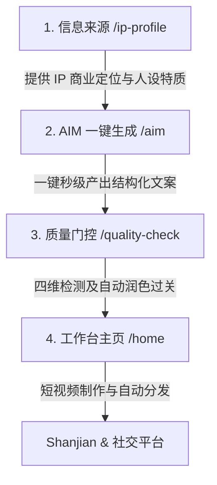

# 明远AIM Direction A 核心工作流架构指南

> **文档版本**: 1.0.0 (2026-05)  
> **受众**: 项目核心开发人员、AI 协作 Agent、技术架构师  
> **核心原则**: 规避割裂操作，贯彻以 `AIM 一键生成` 为灵魂的 **4步黄金流水线** 极简体验。

---

## 1. 架构演进背景

在旧版设计中，内容生产流程被割裂为五个独立步骤（信息来源、选题策划、文案创作、质量检控、工作台），包含独立且功能重合的 `/topic-planning` 与 `/copywriting` 页面。这种设计带来严重的体验与工程痛点：
1. **认知负荷高**：小白用户（如小企业主）需要逐个页面跳转、重复输入诉求、手动流转工单，极易流失。
2. **底层引擎割裂**：选题生成器与文案生成器在底层无法做到上下文的高效共享，导致生成的文案常与选题意图脱节。
3. **维护成本高**：多套独立表单、冗余的状态管理和高度重合的 API 链路造成了前端组件和后端 API 的冗余。

为了解决上述问题，系统全面落地 **"Direction A" (AIM 一键生成为核心)** 架构。我们将“选题策划”与“文案创作”两层精髓**全量收拢**至一处，开创了极简的 4 步黄金流。

---

## 2. 4步黄金流水线

重构后的系统完全围绕这 4 个核心枢纽进行组织，并在侧边栏菜单及工作台状态追踪中保持绝对对齐：

### 2.1 步骤 ①：信息来源 (`/ip-profile`)
* **定位**：整个内容生产线的底座，解决“你是谁、你的主打卖点是什么、你在跟谁说话”。
* **机制**：通过五问向导（行业 → 目标客户 → 变现方式 → 个人特质 → 内容目标），由 AI 自动生成三维 IP 定位（商业定位 + 人设定位 + 内容定位）。
* **技术关联**：IP 档案数据会作为核心上下文，在步骤 ② 中自动融入所有的 AI Prompt，确保生成的每句话都合乎主人设。

### 2.2 步骤 ②：AIM 一键生成 (`/aim`)
* **定位**：全功能生成中枢，内容生产系统的绝对灵魂。
* **机制**：
  * 支持文字灵感录入与**语音实时转写**（对小白用户极度友好）。
  * 深度整合 **12大爆款选题黄金元素** 与 **7开头 x 8结构 x 4结尾** 口播生成逻辑。
  * 用户只需在单一页面一键提交，系统自动完成选题决策与多版本脚本文案生成，避免繁琐的多页流转。
* **页面收拢**：原本独立的 `/topic-planning` 和 `/copywriting` 页面已被移出导航，它们的生成逻辑已沉淀为 `/aim` 下的底层引擎逻辑。

### 2.3 步骤 ③：内容质量检控 (`/quality-check`)
* **定位**：内容品质的终极把关者与过滤器。
* **机制**：
  * **四维自动检测**：编辑质量（完整度/可读性/人设匹配）、AI味检测（93个禁词黑名单评分）、吸引力（钩子/悬念）、逻辑一致性（论据匹配）。
  * **智能润色**：当得分不及格时，AI 自动重构（最高 3 次限制），确保最终流出的皆是极具营销感与播音感的成片文案。

### 2.4 步骤 ④：工作台主页 (`/home`)
* **定位**：短视频资产总看板与自动分发终端。
* **机制**：展示 4 步流状态指示器引导新用户；汇总展示历史生成的音视频任务；提供视频预览、审核、一键推送至 `social-auto-upload` 模块进行 Douyin、Xiaohongshu 等多平台自动化发布。

---

## 3. 技术规约与防倒退红线 (Hard Rules)

为了保持架构的纯净与稳定，所有开发人员（与 AI 智能体）必须严厉遵守以下规范：

### 🚨 绝对禁止重新暴露独立页面
* **红线**：严禁在侧边栏 [app-sidebar.tsx](file:///Users/xiangyu/Desktop/明动aim智能体/mingyuan/apps/web/src/components/layout/app-sidebar.tsx) 或工作台指示器 [home/page.tsx](file:///Users/xiangyu/Desktop/明动aim智能体/mingyuan/apps/web/src/app/(dashboard)/home/page.tsx) 中重新引入独立 `/topic-planning` 或 `/copywriting` 的链接。
* **要求**：如需对选题或文案逻辑进行优化，请直接修改 `mingyuan/apps/web/src/lib/aim-generator.ts` 或对 `/aim` 页面底部的表单交互进行升级。

### 🚨 绝对禁止引入运行时 Mock
* **红线**：严禁为了“先跑通界面”在任何生产 API 或运行时链路中添加硬编码的假数据、模拟响应（例如在 `/api/aim/transcribe` 接口中返回写死的 mock 文本）。
* **规范**：若外部依赖（如 Aliyun NLS）不可用，必须返回规范的 HTTP `503 Service Unavailable` 或给出真实的错误提示，让系统随时保持诚实，暴露真实的环境依赖。

### 🚨 视频生成三层架构的清晰界限
视频生成是由三个互相隔离又高度关联的逻辑层组成，**绝对不允许混淆各层级的职责与数据模型**：
1. **导演层 (`VideoStructure`)**：仅决定视频的叙事结构、节拍分布与画面剪辑倾向（不含具体文字）。
2. **编剧层 (`Script` / `ContentTemplate`)**：仅决定具体的脚本字数、钩子句式与说服文案。
3. **包装层 (`VideoPackagingTemplate` / `VideoProductionPlan`)**：仅负责闪剪/Shanjian的模板选用、素材与段落映射、BGM和字幕版式等渲染层配置。
* **重点**：闪剪包装模版属于 **包装层**，绝不能作为内容结构或文案模板进行建模。

---

## 4. 前端样式及框架规范

1. **Tailwind v4 JIT 兼容**：
   * 在使用侧边栏等交互状态时，v4 并不原生支持未定义的非标准数值（如 `border-l-3`）。
   * 必须使用标准数值（如 `border-l-2`）或严格符合 JIT 规范的任意值写法（如 `border-l-[3px]`）以防止样式在构建时丢失。
2. **组件一致性**：
   * 所有 UI 必须统一使用 `src/components/ui` 中的原生 `shadcn/ui` 基础组件（如 Dialog, Button, Progress 等）。
   * 任何新页面的视觉迭代，必须遵循高阶审美体系，包含 smooth gradients 和 glassmorphism，营造极佳的高维专业质感。
