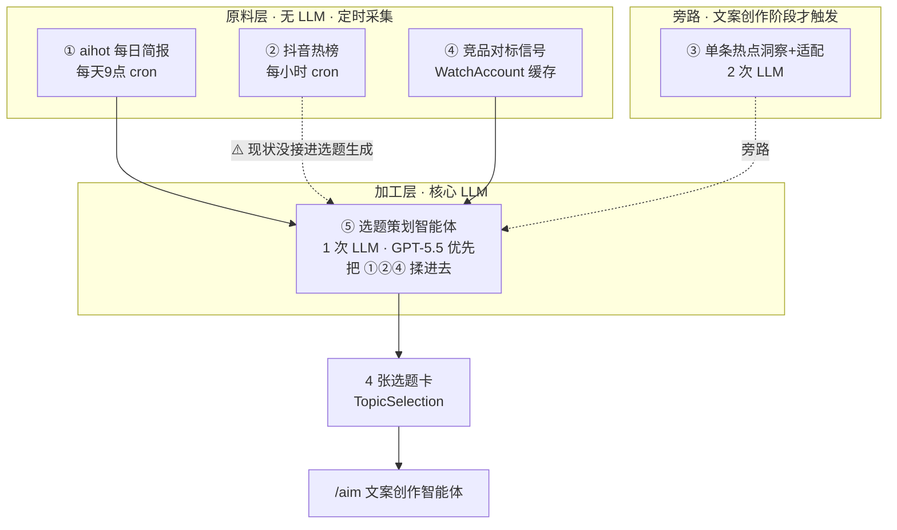
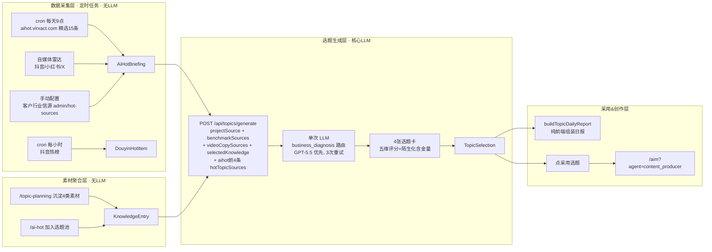
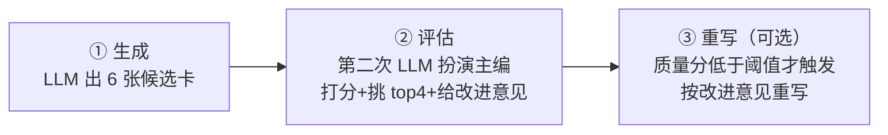
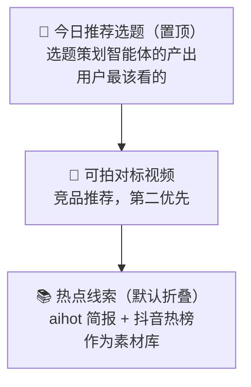

# 热点 / 竞品 / 选题 体系架构优化方案

> **文档目的**：把「热点选题、竞品对标、aihot 每日选题、选题策划智能体」这四个容易混淆的板块，从代码现状、问题诊断、到目标架构、分阶段落地，一次性讲清楚。读完这份文档，思路应该不再乱。
>
> **范围**：工作区 `mingyuan/apps/web` 下与"热点/选题/竞品"相关的全部代码。
> **状态**：方案文档（零代码改动）。审阅后决定是否启动某个 Phase。
> **决策前提**：aihot 定位保持「简报 = 原料，选题 = 加工」，不强行合并成一条主线。
> **日期**：2026-07-07

---

## 目录

1. [现状全景：你其实有 5 个子系统](#第一部分--现状全景)
2. [5 个核心问题诊断](#第二部分--5-个核心问题诊断)
3. [目标架构：4 个痛点各对应一个解](#第三部分--目标架构)
4. [分阶段落地路线图](#第四部分--分阶段落地路线图)
5. [风险与回滚](#第五部分--风险与回滚)
6. [不改动的边界](#第六部分--不改动的边界)
7. [附录：关键文件清单](#附录--关键文件清单)

---

## 第一部分 · 现状全景

### 1.1 你其实有 5 个子系统（不是 4 个）

"热点选题、竞品对标、aihot 每日选题、选题策划智能体"听起来是 4 个东西，**实际代码里是 5 个独立子系统**，且边界没划清。这是思路乱的根本原因。

| # | 子系统 | 对外入口 | 有没有 LLM | 产物表 | 定位 |
|---|--------|----------|-----------|--------|------|
| ① | **aihot 每日简报**（产品叫"选题雷达"） | `/ai-hot` + `/api/aihot-briefing/*` + 每日9点 cron | ❌ 无（纯规则筛选） | `AiHotBriefing` | 原料层：每天自动拉一份 AI 圈线索 |
| ② | **抖音热榜** | `HotDecisionPanel source="market"` + 每小时 cron | ❌ 无 | `DouyinHotItem` | 原料层：抖音实时热榜 |
| ③ | **单条热点洞察+适配** | `/api/hot-topics/[id]/insight\|fit` | ✅ 2 次 LLM | `HotTopicFitCache` | 旁路：文案创作阶段借势单条热点时触发 |
| ④ | **竞品对标 + 视频推荐** | `/competitor` | ✅ 1 次（深度分析）+ ❌（视频推荐纯规则） | `CompetitorAnalysis` / `WatchAccount` | 信号层：已验证的可迁移内容母题 |
| ⑤ | **选题策划智能体** | `/topic-planning` → `/api/topics/generate` | ✅ 1 次（核心） | `TopicSelection` | **加工层：唯一真正生成选题的地方** |

### 1.2 它们的关系图



**关键结论**：
- **"aihot 每日简报" ≠ "选题策划智能体"**。aihot 简报是每天9点自动拉的线索池（无 AI 加工）；选题策划是用户进工作台时，把 aihot 前 4 条 + 对标账号 + 项目全案 + 选题池揉进一次 LLM 生成 4 张卡。
- **"热点选题"这个词是历史包袱**。`/hot-topics` 页面已经废弃，只有一行 `redirect("/ai-hot")`，但底层 `/api/hot-topics/*` 一堆路由还活着，跟 aihot 路由并存，是命名混乱的根源。
- 整套体系的"智能"程度：**选题策划是单次 LLM 调用**（不是多步 agent / function calling / 工具链），差异化、去重、风险控制全靠 prompt 里硬编码的规则指令。

### 1.3 完整数据流（从采集到创作）



**选题素材优先级**（来自 `topic-source-builders.ts` 的 `buildTopicSources`）：
```
项目全案(client_project) > 对标账号(benchmark_reference) > 文案拆解(benchmark_reference)
> 选题池素材(selectedKnowledge) > 行业热点(industry_hot / aihot)
```
这个优先级是**产品刻意设计的"对标优先于热点"原则**——热点只能作行业线索和时效角度，不让通用 AI 热点覆盖账号本身。

---

## 第二部分 · 5 个核心问题诊断

### P1 · 概念碎片化 + 命名重叠（思路乱的技术根源）

- `aihot-briefing` / `hot-topics` / `hot-topics/ai` / `hot-topics/ai/daily` **四套路由都在读同一个 aihot 数据源**，职责不清：
  - `/api/aihot-briefing/today`：前端主入口，带账号信源切换
  - `/api/hot-topics`：`source=aihot` 时读 aihot，叠加模板匹配
  - `/api/hot-topics/ai`：纯代理，直连 aihot items
  - `/api/hot-topics/ai/daily`：纯代理，直连 aihot daily
- `/api/aihot-briefing/today` **一个端点同时承担"AI HOT 简报"和"客户行业信源热点"两种语义**（靠 `audience` 字段区分 `self_media` / `client_industry`），语义耦合。
- aihot 有**两套拉取实现**：
  - `aihot-client.ts`（带 Redis + ETag 缓存）
  - `aihot-briefing.ts` 里直接 `fetch`（无缓存）
  - 逻辑重复，维护成本翻倍。

### P2 · 三套热点线索没有统一抽象（数据浪费）

aihot 精选 / 抖音热榜 / 客户行业信源是**三套独立的数据源 + 表 + 筛选逻辑**，但没有一个统一的"热点信号"抽象层。

最严重的后果：**抖音热榜和客户行业信源根本没有进选题生成**。看 `topics/generate/route.ts` 的 `getHotTopicSources()`：
```ts
async function getHotTopicSources() {
  const briefing = await getTodayAiHotBriefing()  // 只读 aihot 简报
  return briefing.items.slice(0, 4).map(...)       // 只取 aihot 前4条
}
```
抖音热榜每小时在采集、存库，但选题策划时**压根没用上**——这是明显的数据浪费。

### P3 · 竞品视频推荐 vs 选题策划是两套并行逻辑

- **竞品视频推荐**（`competitor-watch-recommendations.ts`）：纯规则打分（热度 35 + 类目 20 + 匹配 18 + 时效 18 + 可行 9 = 100 分），出"今日可拍对标视频"。
- **选题策划**（`topic-generation.ts`）：LLM 生成选题卡。
- 两者**各出各的推荐**，用户在 `/ai-hot` 页同时看到 aihot 热点 + 竞品视频推荐 + 决策面板，信息密度高、来源混杂，认知负担重。

### P4 · 选题策划智能体"不够智能"

- **单次 LLM 调用**，prompt 把所有方法论硬编码进去（陌生化、五维评分、对标优先规则等）。
- 三份方法论 md（`ip_copywriting` / `business_diagnosis` / `event_storytelling`）**只在文案创作阶段注入，选题生成阶段没有注入**——明明有 `agent-methodology-store.ts` 的热更新机制却没用。
- 一次生成 4 张卡就定稿，**缺乏"生成 → 评估 → 重写"的迭代环节**。
- 没有候选对比：6 张候选里直接出 4 张，没有"主编"视角二次筛选。

### P5 · 数据时效与失效链路

- aihot 简报**每天9点生成一次，之后全天走缓存**。但 aihot.virxact.com 是滚动更新的，9 点后出的新内容用户看不到（除非手动 refresh）。
- 抖音热榜**每小时刷新**，但和 aihot 简报是两张皮，没合流。
- 两套采集节奏不一致，且没有"实时补充"机制。

---

## 第三部分 · 目标架构

4 个痛点各对应一个解，互不冲突，可独立推进。

### 目标 1：理清架构 → 引入"统一热点信号层" `HotSignal`

**思路**：新增 `src/lib/hot-signals/` 目录，定义统一接口，把三套数据源归一化。

```ts
// src/lib/hot-signals/types.ts
export interface HotSignal {
  id: string
  source: 'aihot' | 'douyin' | 'client_industry' | 'creator'
  title: string
  summary: string
  url: string
  publishedAt: string | null
  category: string
  signalStrength: number    // 0-100 归一化热度（跨源可比）
  freshness: 'realtime' | 'today' | 'recent'
}
```

**三个 adapter**（只读现有表/数据源，不动存储）：
```ts
// src/lib/hot-signals/adapters/aihot-adapter.ts
export async function getAihotSignals(): Promise<HotSignal[]>

// src/lib/hot-signals/adapters/douyin-adapter.ts
export async function getDouyinSignals(): Promise<HotSignal[]>

// src/lib/hot-signals/adapters/client-industry-adapter.ts
export async function getClientIndustrySignals(userEmail: string): Promise<HotSignal[]>
```

**统一聚合入口**：
```ts
// src/lib/hot-signals/aggregator.ts
export async function getUnifiedHotSignals(options: {
  userEmail?: string
  limit?: number
  sources?: HotSignal['source'][]
}): Promise<HotSignal[]>  // 跨源合并 + 按 signalStrength 排序
```

**配套清理**：
- 合并 `aihot-client.ts` 和 `aihot-briefing.ts` 的拉取逻辑为单一 `aihot-source.ts`（保留 Redis + ETag 缓存能力）。
- 废弃 `/api/hot-topics/ai` 和 `/api/hot-topics/ai/daily` 两个纯代理路由（功能已被 `aihot-briefing` 完全覆盖）。

### 目标 2：选题质量升级 → 选题策划从"单次调用"升为"生成→评估→重写"三段式

**思路**：在 `topic-generation.ts` 内重构，对外接口 `generateTopicCards` 签名不变，内部增强。



**关键设计**：
- **接入方法论 md**：复用现有 `agent-methodology-store.ts` 的 `getMethodologyBlock('business_diagnosis')`，在 system prompt 注入（支持后台热更新）。
- **评估环节**（新增 `evaluateTopicCards`）：第二次 LLM 调用，扮演"严苛主编"，对 6 张候选卡独立打分，挑出 top 4，并给每张卡改进意见。
- **条件重写**：仅当某张卡质量分低于阈值时，才触发第三次 LLM 调用按改进意见重写（控制成本）。
- **兜底不变**：保留 `fallbackTopicCards` 机制，任何环节全失败仍返回可用卡片，不降低可用性。

**成本影响**：从 1 次 LLM 调用 → 2-3 次。预估 token 增量：评估环节约 +1.5k tokens/次（输入6张卡摘要+输出打分），重写仅在低质量卡触发。按当前 `business_diagnosis` 路由（GPT-5.5 优先）估算，单次选题生成成本约增加 60-100%。

### 目标 3：热点信号用起来 → 统一 HotSignal 喂给选题策划

**思路**：`topics/generate` 的 `getHotTopicSources()` 从"只取 aihot 前 4 条"升级为"调 HotSignal 层取所有来源 top N 条"。

```ts
// 改造前（topics/generate/route.ts）
async function getHotTopicSources() {
  const briefing = await getTodayAiHotBriefing()
  return briefing.items.slice(0, 4).map(...)  // 只有 aihot
}

// 改造后
async function getHotTopicSources(userEmail?: string) {
  const signals = await getUnifiedHotSignals({ userEmail, limit: 8 })
  return signals.map(signal => ({
    category: 'industry_hot',
    title: signal.title,
    content: `${signal.source}｜${signal.summary}｜${signal.url}`,
  }))
}
```

**收益**：抖音热榜 + 客户行业信源首次进入选题生成，跨源按热度排序，优先级仍遵守"对标 > 热点"。

### 目标 4：页面理顺 → `/ai-hot` 信息分层，突出"今日该拍什么"

**思路**：`/ai-hot` 页分三层呈现，按决策重要性排序，不删除现有信息，只重新分层 + 默认折叠。



- 每个热点信号增加**信号强度可视化**（基于 `signalStrength` 0-100，用进度条/色块），让用户一眼看出哪些值得追。
- 现有信息全部保留，只是默认收起下层，降低首屏认知负担。

---

## 第四部分 · 分阶段落地路线图

每个阶段独立可交付、可回滚、可独立验证收益。

### Phase 0 · 零风险清理（半天）

- 合并两套 aihot 拉取实现 → 单一 `aihot-source.ts`（保留 Redis + ETag 缓存）
- 删除 `/api/hot-topics/ai` 和 `/api/hot-topics/ai/daily` 两个死路由
- **风险**：纯重构，行为不变。删除路由前需确认无前端引用（grep 检查）。
- **收益**：减少维护负担，消除命名困惑。

### Phase 1 · 统一热点信号层（2-3 天）

- 新建 `src/lib/hot-signals/` 目录 + 三个 adapter + 聚合入口
- 不动现有表和路由，先在 lib 层建抽象
- `topics/generate` 切到新数据源（`getHotTopicSources` 改造）
- **风险**：不破坏任何对外 API 契约。新数据源 fallback 到现有 aihot 行为。
- **收益**：抖音热榜 + 客户信源首次进入选题生成（解决 P2）。

### Phase 2 · 选题策划三段式升级（3-5 天）

- 在 `topic-generation.ts` 内加 `evaluateTopicCards` + 条件重写
- 接入方法论 md（`getMethodologyBlock`）
- 对外接口 `generateTopicCards` 签名不变
- **风险**：增加 1-2 次 LLM 调用成本（成本估算见目标 2）。兜底机制保留，可用性不降。
- **收益**：选题质量提升（双模型交叉评估 + 主编筛选）（解决 P4）。

### Phase 3 · 页面分层重构（2-3 天）

- `/ai-hot` 页三层布局 + 信号强度可视化
- 默认折叠下层，突出"今日推荐选题"
- **风险**：纯前端，可灰度上线。
- **收益**：认知负担下降（解决 P3 的呈现层 + 信息分层）。

### Phase 4（可选）· aihot 时效优化（1-2 天）

- 把 aihot 简报从"每天9点一次"改为"9 点全量 + 每小时增量补充"
- 复用 HotSignal 层的实时拉取能力
- **风险**：增加 aihot.virxact.com 请求频率，需注意 600 req/min 限流（串行 + 间隔）。
- **收益**：解决 9 点后新内容看不到的问题（解决 P5）。

### 建议推进顺序

```
Phase 0（立即，零风险）→ Phase 1（热点信号层，解决数据浪费）
→ Phase 2（选题质量，核心价值）→ Phase 3（页面，体验）
→ Phase 4（可选，时效）
```

---

## 第五部分 · 风险与回滚

| 阶段 | 风险等级 | 回滚方式 | 关键检查点 |
|------|---------|---------|-----------|
| Phase 0 | 低 | git revert | 删除路由前 grep 前端引用；合并 aihot 实现后跑现有测试 |
| Phase 1 | 低 | `getHotTopicSources` 改回只读 aihot | 新 adapter 单测覆盖；信号归一化逻辑测试 |
| Phase 2 | 中 | `generateTopicCards` 内部关掉评估/重写，回到单次调用 | 评估打分质量人工抽检；成本监控 |
| Phase 3 | 低 | 前端还原分层 | 灰度验证用户认知负担是否下降 |
| Phase 4 | 低 | 改回每天9点一次 | aihot 限流监控 |

**通用回滚原则**：
- 每个阶段独立 PR，不交叉依赖。
- Phase 1/2 不破坏任何对外 API 契约，可随时回退。
- Phase 2 的成本增加是主要风险点，建议先在 `business_diagnosis` 路由做 A/B：50% 流量走三段式、50% 走单次，对比选题采用率。

---

## 第六部分 · 不改动的边界

**尊重已确认的产品决策，以下不改动**：

1. **aihot 定位不变**：保持「简报 = 原料，选题 = 加工」，不强行合并成"每日选题"一条主线。两者各司其职，只优化衔接（目标 3）。
2. **三份方法论 md 的编辑入口不动**：`admin/methodology` 页面和 `agent-methodology-store.ts` 的热更新机制保持原样，Phase 2 只是"读取注入"，不改编辑链路。
3. **现有数据表不删不改结构**：`AiHotBriefing` / `DouyinHotItem` / `HotTopicFitCache` / `CompetitorAnalysis` / `WatchAccount` / `TopicSelection` 全部保留。新增能力优先复用现有字段，HotSignal 层是只读聚合，不落新表。
4. **"对标优先于热点"原则不变**：素材优先级 `client_project > benchmark_reference > selectedKnowledge > industry_hot` 保持，HotSignal 层只是丰富了 `industry_hot` 的来源。
5. **单条热点适配旁路（③）不动**：它服务于文案创作阶段借势单条热点，定位清晰，不在本轮优化范围。

---

## 附录 · 关键文件清单

### 选题策划智能体（⑤ 核心）
- 选题生成核心：`src/lib/topic-generation.ts`（`generateTopicCards` / `buildTopicSystemPrompt` / `buildTopicUserPrompt` / `normalizeTopicCards` / `fallbackTopicCards`）
- 素材构建：`src/lib/topic-source-builders.ts`（`buildTopicSources` 定义优先级顺序）
- 元素采样/差异化：`src/lib/topic-element-logic.ts`
- 陌生化含金量：`src/lib/topic-defamiliarization.ts`
- 选题校验：`src/lib/topic-validation.ts`
- 选题日报：`src/lib/topic-daily-report.ts`
- 选题 API：`src/app/api/topics/{generate,today,chat}/route.ts`

### aihot 每日简报（①）
- 简报生成：`src/lib/aihot-briefing.ts`（`getTodayAiHotBriefing` / `generateAndStoreAiHotBriefing` / `fetchSelectedItems` / `selectBriefingItems`）
- aihot 客户端：`src/lib/aihot-client.ts`（带 Redis + ETag 缓存）
- 自媒体雷达：`src/lib/ai-news-radar-client.ts`
- 客户行业信源：`src/lib/account-industry-sources.ts` + `src/lib/hot-source-settings.ts`
- 简报 API：`src/app/api/aihot-briefing/{today,today/refresh}/route.ts`
- 定时任务：`src/app/api/cron/aihot-briefing/route.ts`

### 抖音热榜（②）
- 热榜采集：`src/lib/douyin-hot.ts`（`fetchAndStore`）
- 定时任务：`src/app/api/cron/douyin-hot/route.ts`
- 表：`DouyinHotItem` / `DouyinHotSnapshot`（schema.prisma:784/809）

### 单条热点洞察+适配（③ 旁路）
- 热点情报：`src/lib/hot-topic-intelligence.ts`（`fetchSearchEvidence` / `generateInsight` / `evaluateHotTopicFit`）
- API：`src/app/api/hot-topics/[id]/{insight,fit}/route.ts`
- 表：`HotTopicFitCache`（schema.prisma:607）

### 竞品对标（④）
- 分析管道：`src/lib/competitor-analysis/{pipeline,collector,analyzer,metrics}.ts`
- RedFox 数据源：`src/lib/competitor-analysis/redfox-douyin-api.ts` + `redfox-similar-accounts.ts`
- 视频推荐（纯规则）：`src/lib/competitor-watch-recommendations.ts`
- 爆款计算：`src/lib/competitor-watch-viral.ts`
- AIM 上下文桥接：`src/lib/aim-competitor-watch-context.ts`
- API：`src/app/api/competitor/{analyze,[id],reports,discover-similar,watch-accounts/*}/route.ts`
- 表：`CompetitorAnalysis` / `WatchAccount` / `VideoCopyExtraction`（schema.prisma:988/1041/1076）

### 智能体方法论系统（供 Phase 2 复用）
- 方法论加载：`src/lib/agent-methodology-store.ts`（`getMethodologyBlock` / 三份方法论 + 版本号失效缓存）
- 模型路由：`src/lib/llm/agent-router.ts`（`getAgentLLM("business_diagnosis")`）
- LLM 客户端：`src/lib/llm/client.ts`（`LLMClient.shared().complete()`）
- 方法论 md：`mingyuan/docs/{ip-copywriting,business-diagnosis,event-storytelling}-methodology-core.md`

### 前端页面
- 全网热点洞察：`src/app/(dashboard)/ai-hot/page.tsx`
- 选题工作台：`src/app/(dashboard)/topic-planning/page.tsx`（约 1248 行，选题系统门面）
- 竞品研究：`src/app/(dashboard)/competitor/page.tsx` + `competitor/[id]/page.tsx`
- 灵感收集（独立，不碰 aihot）：`src/app/(dashboard)/inspiration/page.tsx`
- 已废弃：`src/app/(dashboard)/hot-topics/page.tsx`（仅 `redirect("/ai-hot")`）

### 数据库 Schema
- 位置：`mingyuan/apps/web/prisma/schema.prisma`（33 个模型）
- 相关模型见各子系统"表"字段。

---

## 一句话总结

> 你现在有 5 个子系统，但只有 1 个（选题策划智能体）真正"智能"。优化方向是：① 用 HotSignal 层统一三套热点线索，② 让抖音热榜/客户信源进选题生成，③ 把选题策划从单次调用升级为"生成→评估→重写"，④ 页面分层突出"今日该拍什么"。aihot 保持"原料"定位不变。分 5 个 Phase，每个可独立交付回滚。
