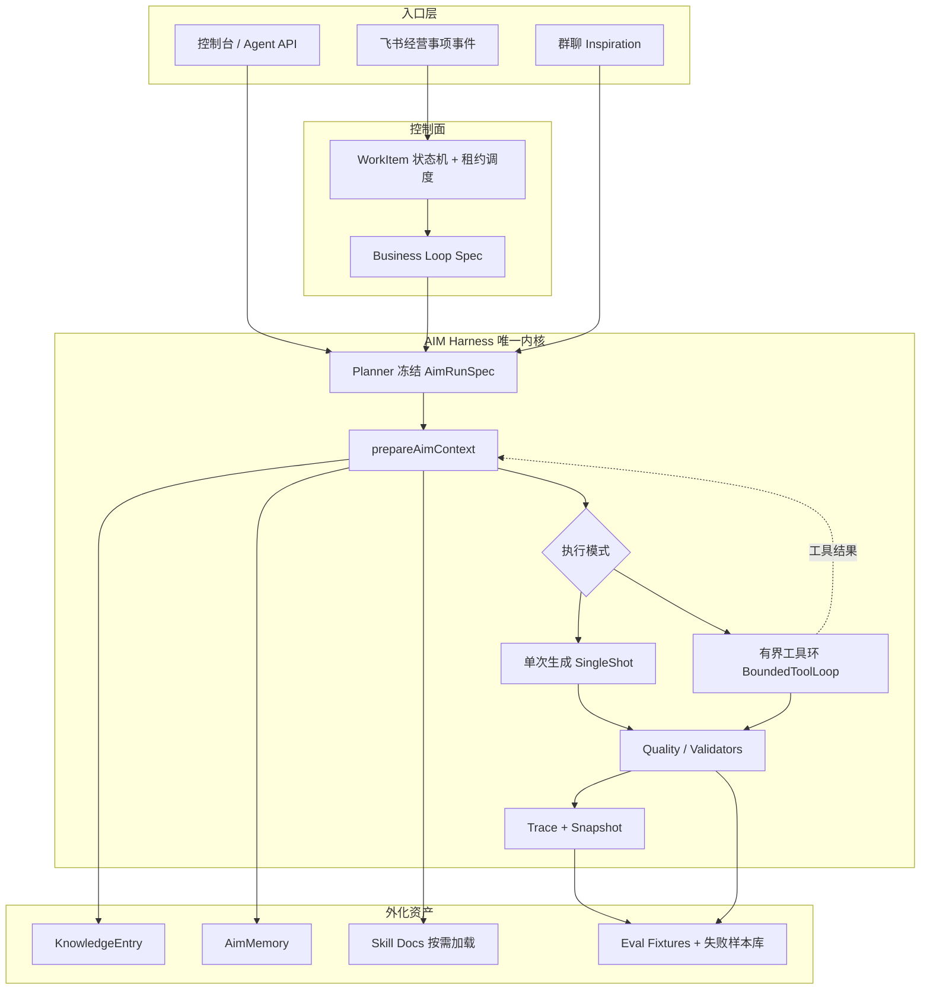

# AIM Agent 能力缺口升级设计计划

> 状态：设计稿（§8 已关闭）  
> 日期：2026-07-24  
> **执行正本**：[`2026-07-24-aim-14w-upgrade-execution-plan.md`](./2026-07-24-aim-14w-upgrade-execution-plan.md)  
> 依据：[`ai-agent-book`](https://github.com/bojieli/ai-agent-book) 核心观点 × 当前策略差距分析  
> 相关：`AGENTS.md` · `docs/architecture/adr-001-aim-harness-execution-kernel.md` · `docs/plans/aim-ai-native-company-zcode-execution-plan.md` · `docs/adr/001-feishu-asset-landing.md`

---

## 0. 一句话目标

在**不引入第二套 Agent Runtime**的前提下，把 AIM 从「强 Harness + 一次规划生成」升级为「**可证伪、有界自主、可外化学习**」的生产级 Agent 系统，优先打通经营闭环与评估门禁，再扩展工具环与经验沉淀。

---

## 1. 问题陈述（来自差距分析）

| ID | 缺口 | 业务后果 | 书中对应 |
|---|---|---|---|
| G1 | `eval:daily` / model-swap 未进常态门禁 | 换模型、改 prompt 靠直觉；Harness 与模型瓶颈分不清 | 第 6 章评估 |
| G2 | 经营事项 live 闭环未达生产验收 | 「AI 原生公司」五闭环卡在集成层 | 第 4 章事件驱动 + 工程实践 |
| G3 | 规划偏「一次冻结」，缺有界 ReAct | 长链路失败恢复依赖人工与状态机 | 第 1/4 章工具循环 |
| G4 | 自我进化停在建议/候选 | 同一客户反复踩坑；经验难复用 | 第 8 章外部化学习 |
| G5 | 内部工具治理弱（多为专用动作） | 能力扩展靠加 handler；选择错误与 token 膨胀 | 第 4 章工具设计 |
| G6 | 记忆质量无评估 | 误记污染上下文 | 第 3/6 章 |
| G7 | 隐性知识入库不足 | 上下文上限被组织信息黑洞卡住 | 第 2 章上下文工程 |

**非问题（明确不在本计划解决）：**

- 引入 Hermes / Dify / CowAgent / 第二套状态机或第二套记忆协议（违反 ADR-001）。
- 立刻做模型后训练 / RL（第 7 章）：仅当评估证明 Harness 已饱和后再单独立项。
- 建设 Agent 商城、几十个新 Agent、复杂多租户中台。
- 无审批自动对外发送客户承诺、报价、正式方案或删除数据。

---

## 2. 设计原则

1. **Harness 唯一内核**：所有新能力经 `executeAimRun` / `streamAimRun` 或既有 Loop 步骤进入；禁止旁路。
2. **有界自主**：允许模型多步工具调用，但必须有 `maxSteps`、token 预算、终止条件、人工接管出口。
3. **评估驱动变更**：改 prompt / 工具 / 记忆策略前，先有可比较信号；发布门禁拒绝「只绿 deterministic」。
4. **外化优于内化**：先沉淀知识条目、Skill 文档、评估样本；不改模型权重。
5. **飞书管状态、AIM 管快照**：经营事项状态正本在飞书；轨迹、评估、记忆在 AIM。
6. **一次一个可验收工作包**：线程边界遵守 `AGENTS.md` §6；分析确认后再实施。

---

## 3. 目标架构（升级后）



### 3.1 两种执行模式（关键新增）

| 模式 | 适用 | 行为 | 约束 |
|---|---|---|---|
| **SingleShot**（现状默认） | 文案生成、轻改、格式化交付 | Planner 冻结 → 一次/少数次 LLM → 质检 | 保持现有路径零回归 |
| **BoundedToolLoop**（本计划新增） | 诊断补证、选题核验、会议后多源检索 | ReAct：思考 → 选工具 → 观察 → 再决策，直到目标或预算耗尽 | `maxSteps≤8`（可配置）、禁止外发副作用工具、超时升级人工 |

选择规则（Planner 扩展，不新建 Runtime）：

```text
若 runtimeTask ∈ {positioning_topic, quality_review} 且 flags.allowToolLoop=true
  或 LoopSpec.steps 声明需要感知工具
→ BoundedToolLoop
否则 → SingleShot
```

第一版只对 **2 条路径** 打开：`sales-diagnosis` 补证检索、`content` 选题前知识核验。其余全部 SingleShot。

### 3.2 工具分层（对齐书第 4 章，落地到 AIM）

| 层 | 内容 | 谁调用 |
|---|---|---|
| L0 通用感知 | `search_project_knowledge`、`get_memory`、`read_work_item`、`read_generation` | BoundedToolLoop |
| L1 专用执行 | 飞书导入导出、发布登记、经营事项回写 | Loop 步骤 / 显式 API，**不**进模型自由选择 |
| L2 协作/审批 | `request_human_review`、`escalate_supervisor` | Loop + ToolLoop 均可 |
| L3 远程 MCP | 现有 `aim-remote`（AIM 被外部调用） | 保持；本计划不扩展为内部主路径 |

原则：**副作用工具不进模型自由选择集**；感知工具可进；写飞书/发消息必须经状态机或人工闸门。

---

## 4. 分阶段方案与工作包

### 阶段 A · 可证伪基线（第 0–2 周）— 关闭 G1

**目标：** 任何影响生成质量的改动，都能在数小时内用同一套评估说清「变好还是变差」。

#### WP-A1：发布门禁接入 `eval:daily`

| 项 | 内容 |
|---|---|
| 做什么 | CI / 候选发布分支必跑 `pnpm --dir apps/web eval:daily`；产物 `report.json` + `report.md` 归档 |
| 门槛 | 契约 100%；rubric pass rate ≥ 80%；`fabricatedFact = 0`；与现有 `evaluateEvalGate(..., "daily")` 对齐 |
| 不做 | 不把 full 套件放进每个 PR（成本过高）；PR 仍用 deterministic |
| 验收 | 故意降级一个 fixture 期望时，门禁失败；密钥缺失时失败而非静默跳过 |
| 依赖 | 密钥注入（GitHub Secrets / 发布机）；报告目录进 artifacts |

#### WP-A2：Model-swap 报告（固定 Harness，换模型）

| 项 | 内容 |
|---|---|
| 做什么 | 新增 `eval:model-swap`：同一 frozen fixtures（建议 5–8 个跨 agent 代表例）分别跑「当前默认模型」与「对照更强/更弱模型」 |
| 输出 | 对比表：契约通过率、rubric 均值、虚构率、平均 token/成本；结论标签：`harness_bound` / `model_bound` / `inconclusive` |
| 判定启发式 | 强模型分数不涨 → `harness_bound`；弱模型大跌且随模型能力波动 → `model_bound` |
| 不做 | 不做统计显著性完整实现（可记 P2）；不做自动切模型 |
| 验收 | 对已知「质检依赖强模型」的 fixture，报告能标出 `model_bound`；报告进 `docs/reports/` 或 CI artifact |

#### WP-A3：路径能力声明文档 + 代码标注

| 项 | 内容 |
|---|---|
| 做什么 | 在 `aim-harness/types` 或 `AimRunSpec` 增加 `executionMode: "single_shot" \| "bounded_tool_loop"` 字段（默认 single_shot）；文档列出各 agent/runtimeTask 当前模式 |
| 验收 | 架构测试：未显式授权的 entrypoint 不得进入 tool loop |

---

### 阶段 B · 经营控制面生产化（第 2–6 周）— 关闭 G2（部分 G7）

**目标：** 飞书一条经营事项能在生产以受控模式跑完状态机，结果可审计。

> 说明：代码侧 WP-2/3/4/8、会议洞察、影子灰度已基本具备（见 2026-07-19 报告）。本阶段重点是 **live 验收与开关治理**，不是重写状态机。

#### WP-B1：生产字段契约终稿与 schema 核对

| 项 | 内容 |
|---|---|
| 做什么 | 用真实 `+field-list` 固化「AIM经营事项」字段名（含 `DISPATCH_FIELDS` / `SUPERVISION_FIELDS`）；与代码常量双向比对测试 |
| 验收 | 字段漂移时 CI 或 `schema:verify` 类检查失败；文档与代码同 PR 更新 |
| 阻塞解除 | cron / 调度接线不再猜字段名 |

#### WP-B2：销售诊断 Loop 扩大灰度 → supervised_auto

| 项 | 内容 |
|---|---|
| 做什么 | 完成计划已列条件：≥10 场真实会议样本、连续 5 工作日观测、备份恢复演练、试点项目与监督群配置 |
| 模式演进 | `shadow` → `assisted` → `supervised_auto`（仍禁止 `allowExternalSideEffects`） |
| 验收 | 同记录幂等；失败可行动错误回写；人工审核闸门有效；健康检查 `feishuReady=true` |
| 不做 | 不自动对客户发消息；不启用 low_risk_auto 对外副作用 |

#### WP-B3：内容增长 / 群聊选题管道影子→正式（按需）

| 项 | 内容 |
|---|---|
| 做什么 | Inspiration 管道生产 migration、环境开关、飞书入口真实联调（见 `HANDOFF.md`） |
| 验收 | 影子模式零正式选题写入；正式模式幂等、可重试、群内回执正确 |
| 依赖 | 独立工作包；不与 B2 混在同一 PR |

#### WP-B4：隐性知识入库最小闭环（G7 起步）

| 项 | 内容 |
|---|---|
| 做什么 | 经营事项「已完成」且人工批准后：自动生成 **Knowledge / Eval 候选**（复用 AssetCandidate 双闸门模式），禁止直接写正式库 |
| 验收 | 无批准零正式写入；同向操作幂等 |

---

### 阶段 C · 有界工具环（第 4–8 周，与 B 可部分并行）— 关闭 G3

**目标：** 在 Harness 内增加可选 BoundedToolLoop，先服务 2 条高价值路径。

#### WP-C1：BoundedToolLoop 内核

| 项 | 内容 |
|---|---|
| 位置 | `apps/web/src/lib/aim-harness/tool-loop.ts`（新建）+ Runtime 分支调用 |
| 契约 | `maxSteps`、`allowedToolNames[]`、`timeoutMs`、每步写入 Trace step、预算耗尽 → `stopReason=token_budget_exceeded` 或 `human_required` |
| 工具执行 | 纯函数端口注入（便于 frozen eval）；禁止在工具实现里直接打未声明副作用 |
| 验收 | 单测：步数上限、非法工具拒绝、超时、成功提前终止；deterministic fixture 覆盖「需要检索才答对」的场景 |

#### WP-C2：L0 感知工具集（最小）

| 工具名 | 作用 | 输出约束 |
|---|---|---|
| `search_project_knowledge` | 项目知识语义检索 | 条数/字符预算与 knowledgeStrategy 对齐 |
| `get_project_memories` | 召回 AimMemory | 按 kind 过滤；摘要长度上限 |
| `read_aim_generation` | 读既有生成稿 | 仅当前项目 |
| `request_human_review` | 请求人工 | 不推进外发；写 Trace |

工具描述必须含「何时用 / 何时不用」（对齐书第 4 章）。

#### WP-C3：两条业务接线

1. **销售诊断补证**：会议洞察后若验证器报缺证据 → ToolLoop 检索知识/记忆再生成，仍经确定性验证器。  
2. **选题前核验**：`positioning_topic` 在信息不足时 ToolLoop 检索，禁止编造；`mustWarnInsufficientInfo` fixture 必须仍通过。

验收：两条路径各 ≥3 个 eval fixture（含失败/不足信息）；SingleShot 路径回归 100%。

---

### 阶段 D · 外部化学习闭环（第 6–12 周）— 关闭 G4、G6

**目标：** Agent「越用越熟练」靠外化资产，而不是更长上下文。

#### WP-D1：失败/优质轨迹 → Eval 样本管道

| 项 | 内容 |
|---|---|
| 做什么 | 从 AimExecutionTrace / Snapshot 抽取：虚构命中、质检 fail、人工大改的 case → 脱敏 → 候选 fixture（JSON） |
| 人工闸门 | 管理员批准后进入 `__tests__/eval/fixtures/` 或独立 `fixtures/generated/` |
| 验收 | 管道不自动改正式 fixture；批准后 `eval:deterministic` 仍绿 |

#### WP-D2：Skill 文档沉淀与按需加载

| 项 | 内容 |
|---|---|
| 存哪 | `docs/methodologies/` 或 DB 命名方法论 profile（已有 ADR-002 方向） |
| 加载 | `prepareAimContext` 按 agent/runtimeTask/tags 注入，计入上下文预算 |
| 来源 | 人工整理优先；可选：从多次成功 Loop 摘要生成「草稿 Skill」再人工发布 |
| 验收 | 未发布 Skill 不进生产上下文；注入后 contextHash 变化可观测 |

#### WP-D3：记忆质量评估集

| 项 | 内容 |
|---|---|
| 指标 | 应记未记率、误记率、有害记忆（一次性指令被当成偏好）检出率 |
| 做法 | 10–20 条人工标注对话 → 跑 `extractAimMemory` → 对比期望 |
| 治理 | 误记支持软删除；定期任务扫描低质量记忆 |
| 验收 | 评估脚本可 CI 跑（可 mock LLM）；上线前人工过一遍标注集 |

#### WP-D4：evolve / AssetCandidate 与 D1–D3 对齐

统一「候选 → 批准 → 正式」语义；禁止三条管道各写一套状态机。

---

### 阶段 E · 工具治理与扩展（第 10–14 周）— 关闭 G5；深化 G7

#### WP-E1：内部工具目录（Tool Registry）

| 项 | 内容 |
|---|---|
| 做什么 | 中央注册：name、描述、何时用/不用、权限级（read/write/external）、是否允许进 ToolLoop |
| 验收 | 未注册工具不可被 Loop/ToolLoop 调用；架构测试扫描硬编码工具名 |

#### WP-E2：MCP 策略定稿

| 项 | 内容 |
|---|---|
| 保持 | `aim-remote` 作为「AIM 被调用」对外面 |
| 可选 | 仅当外部系统需标准协议时扩展；**内部优先 Tool Registry**，不为 MCP 而 MCP |
| 验收 | ADR 短文说明双向边界 |

#### WP-E3：后训练门槛备忘（非实施）

仅当连续两轮 model-swap 显示 `model_bound` 且 Harness 消融（关压缩/关记忆/关 Skill）已做完仍不足时，单独立项评估 SFT/蒸馏。本计划不排期实现。

---

## 5. 优先级总表

| 优先级 | 工作包 | 关闭缺口 | 建议窗口 |
|---|---|---|---|
| P0 | A1, A2 | G1 | 第 0–2 周 |
| P0 | B1, B2 | G2 | 第 2–6 周 |
| P1 | C1, C2, C3 | G3 | 第 4–8 周 |
| P1 | D1, D2 | G4 | 第 6–12 周 |
| P1 | B3, B4 | G2/G7 | 视业务并行 |
| P2 | D3, D4, E1 | G5/G6 | 第 10–14 周 |
| P3 | E2, E3 | 扩展 | 评估触发 |

---

## 6. 验收总标准（四层）

对齐 `AGENTS.md` §7：

1. **代码层**：相关单测、类型、Lint、arch 门禁；ToolLoop / Registry 有契约测试。  
2. **构建层**：影响 Runtime 的改动过生产构建。  
3. **集成层**：飞书真实读写、模型真实 eval:daily、ToolLoop 真实检索最小样本。  
4. **上线层**：明确 commit 部署；`/api/healthz` 回读；影子/正式开关可回读；可回滚。

**本计划「阶段完成」定义：**

| 阶段 | 完成定义 |
|---|---|
| A | PR 与候选发布均有 daily/model-swap 产物；密钥缺失会失败 |
| B | 销售 Loop 达 supervised_auto 试点；字段契约测试绿；≥10 场样本报告 |
| C | 2 路径 ToolLoop 上线且 SingleShot 零回归；新 fixture 进 CI |
| D | 轨迹→候选 fixture 管道可用；≥1 份发布态 Skill；记忆评估集初版 |
| E | Tool Registry 强制；MCP 边界 ADR 合并 |

---

## 7. 风险与回退

| 风险 | 缓解 | 回退 |
|---|---|---|
| ToolLoop 成本与延迟上升 | 严控 maxSteps；仅 2 路径；影子模式先跑 | `executionMode` 强制 single_shot feature flag |
| 评估成本 / 密钥不稳 | daily 抽样 15×2；swap 固定 5–8 例 | 门禁降级为「警告 + 人工签核」须业务书面批准 |
| 飞书字段漂移 | B1 契约测试 | 关闭 Loop live，回 shadow |
| 记忆/Skill 污染上下文 | 候选双闸门；预算计入；可关加载 | 关 Skill 注入 / 记忆召回开关 |
| 范围蔓延成第二 Runtime | 架构守卫 + Code Review 清单 | 拒收 PR |

---

## 8. 拍板事项（已关闭）

> **正本**：[`2026-07-24-aim-14w-upgrade-execution-plan.md`](./2026-07-24-aim-14w-upgrade-execution-plan.md)  
> 本设计稿保留问题陈述与架构意图；**排期、契约字段名、灰度语义与工作包清单以正本为准**。

| # | 议题 | 结论 |
|---|---|---|
| 1 | P0 顺序 | 评估门禁先行；**内容增长为主战场**；销售为第二试点 |
| 2 | ToolLoop 路径 | 内容选题核验 + 销售诊断补证 |
| 3 | eval:daily 成本 | 先按现有 daily（15×2） |
| 4 | Skill 真源 | 仓库文档 + 已发布方法论 profile；自动产物仅候选 |
| 5 | 群聊选题管道 | 纳入本季度（正本阶段 2） |

---

## 9. 实施拆分

见正本「五、工作包与分支」。本设计稿原 A/B/C/D/E 映射：

| 设计阶段 | 正本阶段 | 业务侧重调整 |
|---|---|---|
| A 评估 | 阶段 1 | 不变；契约用 `executionPolicy` |
| B 经营/内容 | 阶段 2 | **内容增长升为 P0**；销售 live 不阻塞内容 |
| C ToolLoop | 阶段 3 | maxSteps=6 / 整环 60s |
| D 外化学习 | 阶段 4 | 不变 |
| E 工具治理 | 阶段 5 | 不变 |

---

## 10. 与既有计划的关系

| 既有文档 | 关系 |
|---|---|
| `2026-07-24-aim-14w-upgrade-execution-plan.md` | **执行正本**；关闭 §8 |
| `aim-ai-native-company-zcode-execution-plan.md` | 经营控制面与 Loop 正本；本计划 **不替代** |
| `aim-context-engineering-plan.md` | 上下文预算已大部分落地；本计划加 Skill 与 ToolLoop 观察回写 |
| ADR-001 Harness / 飞书资产 ADR | 继续遵守；ToolLoop 是 Harness 内模式 |
| 差距分析 Canvas | 本设计是其工程展开；排期以 14 周正本为准 |

---

## 11. 下一步

1. ~~业务负责人回复 §8~~（已关闭）。  
2. 收敛阶段 1（评估门禁 + executionPolicy + 基线）并合并。  
3. 新开阶段 2：`feat/content-growth-loop-register`。  
4. 每个工作包开工声明：目标、允许/禁止修改范围、完成标准。
