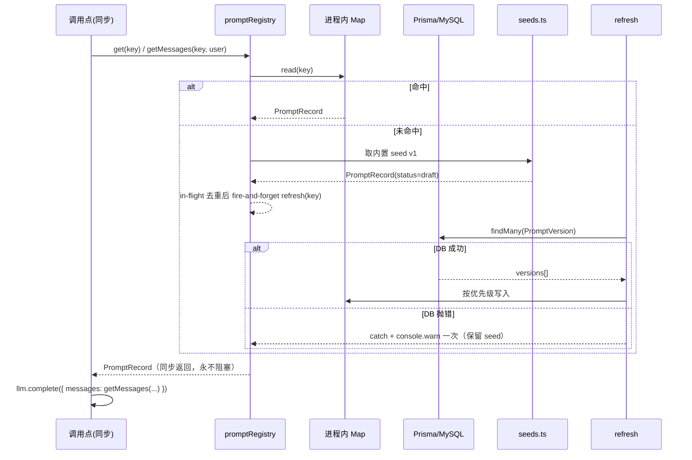

# Prompt Registry 系统设计（Step① 主线 + 批0 六常量）

> 增量开发。约束：最小侵入、可回滚、绝不改变 6 个调用点当前的输出行为。

## 1. 实现方案

**结论**：引入进程内缓存的 Prompt Registry，对外只暴露**同步** `get/getMessages`，内部用「同步读缓存 → 未命中立即回落内置 seed → 后台异步回源 DB」的 stale-while-revalidate 模式。

**关键取舍：同步 vs 异步**
6 个调用点分两类：4 处在 `async` 函数里内联 `messages:[{system,user}]`；2 处（`knowledge-entity-extractor.ts:93`、`aim/meeting-insight-extract.ts:86`）是**同步纯函数** `buildExtractionPrompt()`，有外部调用方与单测依赖，改成 `async` 会污染签名、波及调用链。因此：

- **不采用**「异步 `await registry.load()`」——会把同步纯函数拖成异步，回归风险高。
- **采用**同步优先 + 后台回源：首次调用缓存未命中 → 直接返回内置 seed（seed v1 就是六个文件 prompt 的**逐字原文**，因此首次行为与现状**完全一致，零 diff**），同时 fire-and-forget 触发 `refresh(key)` 拉 DB 覆盖缓存；DB 抛错则吞掉、warn 只打一次。DB 改版后最迟下一个请求生效（热更）。
- 另提供可选 `hydrate()` 供启动预热，但**不强制接入** `instrumentation.ts`（最小侵入）。

代价：首个请求可能仍用 seed 而非 DB 最新版——可接受，且比阻塞出稿安全。

## 2. 文件清单

**新增**
| 路径 | 职责 |
|---|---|
| `apps/web/prisma/prompt.prisma` | `PromptTemplate` / `PromptVersion` 两个模型 |
| `apps/web/prisma/migrations/20260907000000_add_prompt_registry/migration.sql` | 建表 + 唯一索引（不实跑） |
| `apps/web/src/lib/prompt/types.ts` | PromptKey 常量、类型定义、选版规则纯函数 |
| `apps/web/src/lib/prompt/seeds.ts` | 六条 prompt 原文内置兜底常量（逐字搬运） |
| `apps/web/src/lib/prompt/registry.ts` | 缓存 + 同步 get/getMessages + 异步 refresh/hydrate + registerSeed |
| `apps/web/prisma/seed-prompt-registry.ts` | 幂等 seed 脚本（DB 无此 key 才写 draft v1）与反向导出 |
| `apps/web/__tests__/unit/prompt-registry.test.ts` | 选版优先级、回落、幂等单测 |

**修改（仅删常量 + 改一行调用）**
`src/lib/knowledge-entity-extractor.ts`、`src/lib/marketing-analysis.ts`、`src/lib/comment-radar/analyzer.ts`、`src/lib/transcript-polish.ts`、`src/lib/competitor-analysis/analyzer.ts`、`src/lib/aim/meeting-insight-extract.ts`

**禁区（零改动）**：`aim-agent-prompts.ts`、`aim/unified-content-prompts.ts`、`llm/client.ts`、`llm/types.ts`。

## 3. 数据结构与接口

```ts
// src/lib/prompt/types.ts
export type PromptType = "system" | "function" | "inline"
export type PromptStatus = "draft" | "qualified" | "active"
/** 统一 string；原数组形态 seed 用 .join("\n") 存储，保证与现状逐字一致 */
export type PromptContent = string

export const PROMPT_KEYS = {
  knowledgeEntityExtract: "knowledge.entity_extract.default",
  marketingShortvideo: "marketing.analysis.shortvideo",
  commentRadar: "comment.insight.radar",
  transcriptPolish: "marketing.analysis.transcript_polish",
  competitorAnalysis: "competitor.analysis.default",
  meetingInsight: "aim.meeting.insight_extract.default",
} as const

export interface PromptSeed {
  key: string; domain: string; description?: string
  version: number            // 内置固定 1
  type: PromptType           // 批0 全为 "system"
  content: PromptContent
  fixtureKey?: string
}

export interface PromptRecord {
  key: string; version: number; content: PromptContent
  type: PromptType; status: PromptStatus
}

export interface GetOptions { version?: number; status?: PromptStatus | PromptStatus[] }

// src/lib/prompt/registry.ts
export interface PromptRegistry {
  /** 同步。命中缓存返回；未命中立即返回 seed 并后台回源。永不抛错、永不 await。 */
  get(key: string, opts?: GetOptions): PromptRecord
  /** 同步。直接产出 CompletionOptions.messages 的 [system, user] */
  getMessages(key: string, userPrompt: string, opts?: GetOptions): ChatMessage[]
  /** 异步回源；失败回落 seed 并 warn 一次 */
  refresh(key: string): Promise<void>
  /** 批量预热，可选 */
  hydrate(keys?: string[]): Promise<void>
  registerSeed(seed: PromptSeed): void
  __resetForTest(): void
}
export const promptRegistry: PromptRegistry
```

**选版优先级**：显式 `version` > `active` > `qualified` > `draft` > 内置 seed。

**Prisma**：`content String @db.Text`（⚠️ MySQL 下默认 varchar(191) 会截断数千字 prompt，必须 `@db.Text`）；`@@unique([templateKey, version])`；`@@index([status])`。

## 4. 调用流程



## 5. 任务列表

| ID | 任务 | 涉及文件 | 依赖 | 改动量 |
|---|---|---|---|---|
| T1 | 数据层：prisma 模型 + 迁移 SQL + 幂等 seed 脚本（含 `--export` 反向导出） | `prisma/prompt.prisma`、`migrations/20260907000000_add_prompt_registry/migration.sql`、`prisma/seed-prompt-registry.ts` | — | ~150 行新增 |
| T2 | Registry 内核：类型 + 六条 seed 原文搬运 + 缓存/回源/回落 | `src/lib/prompt/{types,seeds,registry}.ts` | T1 | ~350 行新增（seed 占大头） |
| T3 | 六调用点改造：删 SYSTEM_PROMPT 常量，改调 `registry.get/getMessages` | 六个 lib 文件 | T2 | 6 文件 ×约 40 行删 + 1 行改 |
| T4 | 单测 + 校验：`tsc --noEmit` + vitest 全量 + 六处 prompt 逐字 diff 比对 | `__tests__/unit/prompt-registry.test.ts` | T3 | ~120 行新增 |
| T5 | 收尾：seed 双向幂等验证、`prisma/seed.ts` 挂接、CHANGELOG | `prisma/seed.ts`、`CHANGELOG.md` | T4 | ~20 行 |

## 6. 依赖包

**无**。全部使用既有 Prisma / TypeScript 能力。

## 7. 共享知识

- key 命名 `<domain>.<capability>.<variant>`，常量只在 `types.ts` 的 `PROMPT_KEYS` 定义，调用点禁止写字面量。
- 内容一律 `string`；数组形态用 `.join("\n")` 存储，与现状输出逐字一致。
- registry 内部 100% try/catch，**永不向上抛异常**；DB 失败 `console.warn("[prompt-registry]", key, err)` 且每 key 只打一次。
- Prisma 走 lazy `import("@/lib/prisma")`（避免在无 DB 的测试/edge 环境副作用）。
- 测试命名 `__tests__/unit/prompt-registry.test.ts`，用 `registerSeed` + 替身，**不连真实 DB**。
- 禁止新增 API 路由、UI、缓存 TTL（P1 再议）。

## 8. 待明确事项（默认建议，不阻塞）

1. 是否接 `instrumentation.ts` 启动预热 → **默认不接**，靠首次调用触发。
2. Prisma 单例来源 → **默认复用 `@/lib/prisma`**，lazy 动态 import；若其为 edge 不安全再退化成 registry 内自建。
3. 六文件删除 `SYSTEM_PROMPT` 后是否有外部引用 → T3 开工前再全量 grep 一次；若无引用则直接删。
4. `@db.Text` 与 PRD 的 `content:String` 表述差异 → **采用 `@db.Text`**（String 在 MySQL 是 varchar(191)，会截断）。
