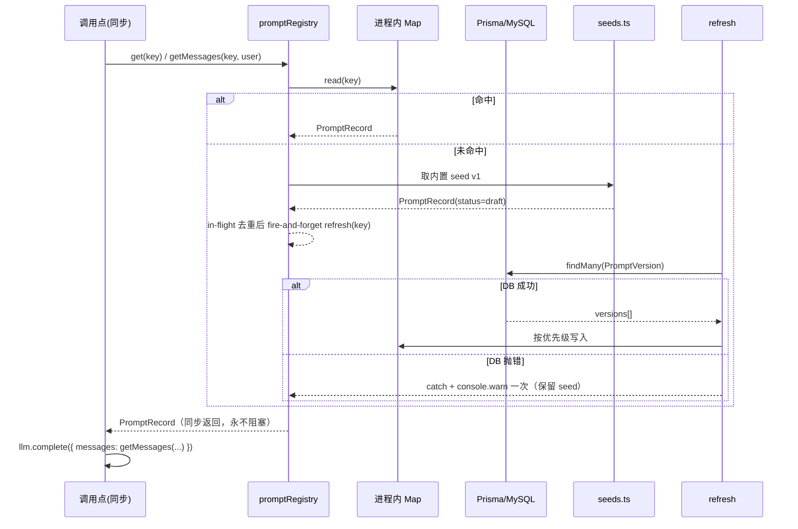

# Prompt Registry 系统设计（Step① 主线 + 批0 六常量）

> 增量开发。约束：最小侵入、可回滚、绝不改变 6 个调用点当前的输出行为。

## 1. 实现方案

**结论**：引入进程内缓存的 Prompt Registry，对外只暴露**同步** `get/getMessages`，内部用「同步读缓存 → 未命中立即回落内置 seed → 后台异步回源 DB」的 stale-while-revalidate 模式。

**关键取舍：同步 vs 异步**
6 个调用点分两类：4 处在 `async` 函数里内联 `messages:[{system,user}]`；2 处（`knowledge-entity-extractor.ts:93`、`aim/meeting-insight-extract.ts:86`）是**同步纯函数** `buildExtractionPrompt()`，有外部调用方与单测依赖，改成 `async` 会污染签名、波及调用链。因此：

- **不采用**「异步 `await registry.load()`」——会把同步纯函数拖成异步，回归风险高。
- **采用**同步优先 + 后台回源：首次调用缓存未命中 → 直接返回内置 seed（seed v1 就是六个文件 prompt 的**逐字原文**，因此首次行为与现状**完全一致，零 diff**），同时 fire-and-forget 触发 `refresh(key)` 拉 DB 覆盖缓存；DB 抛错则吞掉、warn 只打一次。DB 改版后最迟下一个请求生效（热更）。
- 另提供可选 `hydrate()` 供启动预热，但**不强制接入** `instrumentation.ts`（最小侵入）。

代价：首个请求可能仍用 seed 而非 DB 最新版——可接受，且比阻塞出稿安全。

## 2. 文件清单

**新增**
| 路径 | 职责 |
|---|---|
| `apps/web/prisma/prompt.prisma` | `PromptTemplate` / `PromptVersion` 两个模型 |
| `apps/web/prisma/migrations/20260907000000_add_prompt_registry/migration.sql` | 建表 + 唯一索引（不实跑） |
| `apps/web/src/lib/prompt/types.ts` | PromptKey 常量、类型定义、选版规则纯函数 |
| `apps/web/src/lib/prompt/seeds.ts` | 六条 prompt 原文内置兜底常量（逐字搬运） |
| `apps/web/src/lib/prompt/registry.ts` | 缓存 + 同步 get/getMessages + 异步 refresh/hydrate + registerSeed |
| `apps/web/prisma/seed-prompt-registry.ts` | 幂等 seed 脚本（DB 无此 key 才写 draft v1）与反向导出 |
| `apps/web/__tests__/unit/prompt-registry.test.ts` | 选版优先级、回落、幂等单测 |

**修改（仅删常量 + 改一行调用）**
`src/lib/knowledge-entity-extractor.ts`、`src/lib/marketing-analysis.ts`、`src/lib/comment-radar/analyzer.ts`、`src/lib/transcript-polish.ts`、`src/lib/competitor-analysis/analyzer.ts`、`src/lib/aim/meeting-insight-extract.ts`

**禁区（零改动）**：`aim-agent-prompts.ts`、`aim/unified-content-prompts.ts`、`llm/client.ts`、`llm/types.ts`。

## 3. 数据结构与接口

```ts
// src/lib/prompt/types.ts
export type PromptType = "system" | "function" | "inline"
export type PromptStatus = "draft" | "qualified" | "active"
/** 统一 string；原数组形态 seed 用 .join("\n") 存储，保证与现状逐字一致 */
export type PromptContent = string

export const PROMPT_KEYS = {
  knowledgeEntityExtract: "knowledge.entity_extract.default",
  marketingShortvideo: "marketing.analysis.shortvideo",
  commentRadar: "comment.insight.radar",
  transcriptPolish: "marketing.analysis.transcript_polish",
  competitorAnalysis: "competitor.analysis.default",
  meetingInsight: "aim.meeting.insight_extract.default",
} as const

export interface PromptSeed {
  key: string; domain: string; description?: string
  version: number            // 内置固定 1
  type: PromptType           // 批0 全为 "system"
  content: PromptContent
  fixtureKey?: string
}

export interface PromptRecord {
  key: string; version: number; content: PromptContent
  type: PromptType; status: PromptStatus
}

export interface GetOptions { version?: number; status?: PromptStatus | PromptStatus[] }

// src/lib/prompt/registry.ts
export interface PromptRegistry {
  /** 同步。命中缓存返回；未命中立即返回 seed 并后台回源。永不抛错、永不 await。 */
  get(key: string, opts?: GetOptions): PromptRecord
  /** 同步。直接产出 CompletionOptions.messages 的 [system, user] */
  getMessages(key: string, userPrompt: string, opts?: GetOptions): ChatMessage[]
  /** 异步回源；失败回落 seed 并 warn 一次 */
  refresh(key: string): Promise<void>
  /** 批量预热，可选 */
  hydrate(keys?: string[]): Promise<void>
  registerSeed(seed: PromptSeed): void
  __resetForTest(): void
}
export const promptRegistry: PromptRegistry
```

**选版优先级**：显式 `version` > `active` > `qualified` > `draft` > 内置 seed。

**Prisma**：`content String @db.Text`（⚠️ MySQL 下默认 varchar(191) 会截断数千字 prompt，必须 `@db.Text`）；`@@unique([templateKey, version])`；`@@index([status])`。

## 4. 调用流程



## 5. 任务列表

| ID | 任务 | 涉及文件 | 依赖 | 改动量 |
|---|---|---|---|---|
| T1 | 数据层：prisma 模型 + 迁移 SQL + 幂等 seed 脚本（含 `--export` 反向导出） | `prisma/prompt.prisma`、`migrations/20260907000000_add_prompt_registry/migration.sql`、`prisma/seed-prompt-registry.ts` | — | ~150 行新增 |
| T2 | Registry 内核：类型 + 六条 seed 原文搬运 + 缓存/回源/回落 | `src/lib/prompt/{types,seeds,registry}.ts` | T1 | ~350 行新增（seed 占大头） |
| T3 | 六调用点改造：删 SYSTEM_PROMPT 常量，改调 `registry.get/getMessages` | 六个 lib 文件 | T2 | 6 文件 ×约 40 行删 + 1 行改 |
| T4 | 单测 + 校验：`tsc --noEmit` + vitest 全量 + 六处 prompt 逐字 diff 比对 | `__tests__/unit/prompt-registry.test.ts` | T3 | ~120 行新增 |
| T5 | 收尾：seed 双向幂等验证、`prisma/seed.ts` 挂接、CHANGELOG | `prisma/seed.ts`、`CHANGELOG.md` | T4 | ~20 行 |

## 6. 依赖包

**无**。全部使用既有 Prisma / TypeScript 能力。

## 7. 共享知识

- key 命名 `<domain>.<capability>.<variant>`，常量只在 `types.ts` 的 `PROMPT_KEYS` 定义，调用点禁止写字面量。
- 内容一律 `string`；数组形态用 `.join("\n")` 存储，与现状输出逐字一致。
- registry 内部 100% try/catch，**永不向上抛异常**；DB 失败 `console.warn("[prompt-registry]", key, err)` 且每 key 只打一次。
- Prisma 走 lazy `import("@/lib/prisma")`（避免在无 DB 的测试/edge 环境副作用）。
- 测试命名 `__tests__/unit/prompt-registry.test.ts`，用 `registerSeed` + 替身，**不连真实 DB**。
- 禁止新增 API 路由、UI、缓存 TTL（P1 再议）。

## 8. 待明确事项（默认建议，不阻塞）

1. 是否接 `instrumentation.ts` 启动预热 → **默认不接**，靠首次调用触发。
2. Prisma 单例来源 → **默认复用 `@/lib/prisma`**，lazy 动态 import；若其为 edge 不安全再退化成 registry 内自建。
3. 六文件删除 `SYSTEM_PROMPT` 后是否有外部引用 → T3 开工前再全量 grep 一次；若无引用则直接删。
4. `@db.Text` 与 PRD 的 `content:String` 表述差异 → **采用 `@db.Text`**（String 在 MySQL 是 varchar(191)，会截断）。

---

## 9. 实现记录（落地核验 · 2026-09-07 23:05）

**落地分支**：`feat/aim-workbench-experience-upgrade` · commit `ffad9ab2` · 16 文件、+1454/-119 行。

### 实际交付
| 路径 | 状态 |
|---|---|
| `apps/web/prisma/prompt.prisma` | 新增，33 行（PromptTemplate + PromptVersion，`content: String @db.Text`，`@@unique([templateKey, version])`）|
| `apps/web/prisma/migrations/20260907000000_add_prompt_registry/migration.sql` | 新增，35 行（`CREATE TABLE IF NOT EXISTS` + 唯一索引 + FK CASCADE）|
| `apps/web/prisma/seed-prompt-registry.ts` | 新增，184 行（幂等：仅当 key 无版本时写 draft v1；支持 `--export --out=path` 反向导出）|
| `apps/web/src/lib/prompt/types.ts` | 新增，132 行（PROMPT_KEYS / PromptSeed / PromptRecord / GetOptions / selectVersion 纯函数）|
| `apps/web/src/lib/prompt/seeds.ts` | 新增，175 行（六条 prompt 逐字搬运；数组形态用 `.join("\n")`）|
| `apps/web/src/lib/prompt/registry.ts` | 新增，273 行（同步 get/getMessages、stale-while-revalidate、in-flight 去重、REFRESH_RETRY_INTERVAL_MS=60s 节流、warn 每 key 一次）|
| `apps/web/__tests__/unit/prompt-registry.test.ts` | 新增，240 行（16 用例：选版优先级、DB 失败回落、warn-once、seed 幂等、getMessages 结构）|
| 6 调用点 | `knowledge-entity-extractor.ts` / `marketing-analysis.ts` / `comment-radar/analyzer.ts` / `transcript-polish.ts` / `competitor-analysis/analyzer.ts` / `aim/meeting-insight-extract.ts`，均改为 `promptRegistry.get/getMessages(key, …)`，内联 `SYSTEM_PROMPT` 已删除 |
| `mingyuan/docs/plans/2026-09-07-aim-maturity-five-step-upgrade-design.md` | 总纲 |
| `mingyuan/docs/plans/2026-09-07-prompt-registry-prd.md` | PRD |
| `mingyuan/docs/plans/2026-09-07-prompt-registry-design.md` | 本设计文档 |

### 关键决策落地
- **同步优先**：六个调用点（尤其 `buildExtractionPrompt` 同步纯函数）零签名修改，registry 全部同步 API。
- **lazy 动态 import**：`loadVersions` 内 `await import("@/lib/prisma")`，无 DB 的单测/edge 环境无副作用。
- **`@db.Text`**：迁移 SQL 与 prisma schema 都明确 `TEXT`，与设计一致。
- **种子不变 prompt**：seed v1 = 迁移前 `SYSTEM_PROMPT` 逐字原文（数组形态 `.join("\n")`），首次行为与现状零差异。

### 验证结果
- ✅ `npx vitest run __tests__/unit/prompt-registry.test.ts`：**16/16 通过**（10ms）
- ✅ 四个禁区文件 `git diff` vs HEAD：**零改动**（`aim-agent-prompts.ts`、`aim/unified-content-prompts.ts`、`llm/client.ts`、`llm/types.ts`）
- ✅ 六调用点 `grep -E "你是|你是一位"`：**全部 clean**（无中文字面 prompt 残留）

### 与设计的偏差
- 无实质性偏差。`@db.Text` 在 prisma schema 与 SQL 迁移里都正确落地。
- seed 脚本未自动挂到 `prisma/seed.ts`（设计 §8 显式说明「刻意不改 seed.ts」，需运维手动加 2 行）。

### 未做（本批范围之外）
- 缓存 TTL / 手动 reload（P1）
- fixtureKey 升 qualified 门禁（P1）
- 评估调用日志注入（P1）
- 批 1（函数拼接型 6 文件）/ 批 2（API 路由内联 2 文件）
- 首屏即对话、能力 API 契约收敛、HITL 内联、组织协同显性化（其余四步）

---

## 10. 批1 实现记录（函数拼接型 · 2026-09-08）

**落地分支**：`feat/aim-workbench-experience-upgrade`（承接批0）。方案：沿用批0 的 seed v1 逐字兜底 + 同步 registry，函数拼接型的 `${…}` 插值改为 `{name}` 占位符（语义与原 quality-gate 私有 `fillTemplate` 完全一致），调用点预组运行时区块后经 `fillPromptTemplate` 注入。

### 交付
| 路径 | 状态 |
|---|---|
| `src/lib/prompt/template.ts` | 新增，`fillPromptTemplate`（`{name}` 单遍替换、未知 key 空串；quality-gate 私有实现收编为共享） |
| `src/lib/prompt/types.ts` | PROMPT_KEYS 6 → 30（semantic_task 2 / work_editor 3 / content_review 3 / content_retro 2 / script_polish 6 / quality_gate 8） |
| `src/lib/prompt/seeds-aim-agents.ts` | 新增，8 条 seed（work_editor / content_review / content_retro） |
| `src/lib/prompt/seeds-aim-services.ts` | 新增，8 条 seed（semantic_task / script_polish） |
| `src/lib/prompt/seeds-quality-gate.ts` | 新增，8 条 seed（6 模板 + 2 内联 system） |
| `src/lib/prompt/seeds.ts` | 改为聚合入口（批0 原文不动，追加三个批1 数组） |
| 6 调用点 | 删除全部字面 prompt（work-editor 骨架、review/retro builder、script-polish 数组 join、semantic-task 2 常量、quality-gate 6 模板 + 2 内联 system + 私有 fillTemplate） |
| 测试 | `prompt-batch1-snapshot.test.ts`（迁移前基线 29 案例）+ registry 测试扩到 30 seed 断言 + 两个源码契约测试纳入 seed 文件读取 |

### 等价性证明（逐字节）
`prompt-batch1-snapshot.test.ts` 两段式：先在迁移前 commit（`d773d0a3`）把六个文件全部 builder 在条件分支全覆盖下的真实输出写入 fixtures JSON（29 案例：light_edit 开关、workflow/ipWiki 有无、发布数据有无、topicTitle 有无、四类靶向重写等）；迁移后同一测试比对模式逐案例 `toBe` 断言。**迁移中快照实测抓出 2 处换行归属漂移（imitate user 的 topicTitle 尾换行、polish user 的空首元素前导换行 + 尾随双换行），均已修正后全绿。**

### 验证
- ✅ 快照比对 29/29 逐字节一致
- ✅ 全量单测 3225 passed（467 文件；含 107 个六个文件直接相关用例）
- ✅ `tsc --noEmit` 零错误、改动文件 ESLint 零告警
- ✅ 四禁区文件 vs HEAD 零 diff；六文件 `grep "你是"` 无字面残留
- ✅ seed 脚本零改动自动纳管（新 key 首次跑 `seed-prompt-registry.ts` 幂等写入 draft v1）

### 边界与已知保留（非缺陷）
- `buildPublishOutcomeSection`（导出函数，有外部调用方）两个分支文案与 `buildPolishInstructions` 五段条件指令仍在代码里——前者是运行时数据区块包装、后者是逻辑选择的指令片段，均不属于静态正本；留批2/P1 酌情收编。
- work-editor「知识库为空降级策略」文案保留在调用点（降级分支，非主 prompt 正本）。

---

## 11. 批2 实现记录（API 路由内联型 · 2026-09-08）——Step① 收官

**落地分支**：`feat/aim-workbench-experience-upgrade`。全仓扫描 `src/app/api` 共 4 个路由触达 LLM，其中 3 个为内联 prompt（总纲点名的 2 个 + `competitor/search-channels/analyze`）；`competitor-analysis/methodology/compile` 委托 `viral-methodology-compiler` 的 lib 构建器，不属「路由内联」，与 `lib` 内其余散落 prompt 一并列为**批3 扫尾候选**。

### 交付
| 路径 | 状态 |
|---|---|
| `src/lib/prompt/seeds-api-routes.ts` | 新增，7 条 seed（brief/ai-fill 的 system + 有/无描述双分支 user；knowledge/distill 的 system + user；search-channels/analyze 的 system + user） |
| `src/lib/prompt/types.ts` | PROMPT_KEYS 30 → 37 |
| `src/lib/prompt/seeds.ts` | 聚合追加 `API_ROUTES_PROMPT_SEEDS` |
| 3 个 route | 内联模板删除，改为 `promptRegistry.get` + `fillPromptTemplate`；鉴权/解析/响应逻辑零改动 |

### 等价性证明（逐字节）
`prompt-batch2-snapshot.test.ts` 两段式（同批1 方法）：mock 鉴权/prisma/LLM/Tikhub 后真实调用三个 POST handler，捕获 LLM 收到的 messages（8 案例：ai-fill 双模板条件 × 双 user 分支、distill、analyze）。迁移后比对**一次通过**。

### 验证
- ✅ 快照比对 8/8 逐字节一致
- ✅ 全量单测 3226 passed；`tsc --noEmit` 零错误；改动文件 ESLint 无新增告警
- ✅ 三路由 `grep "你是"` 无字面残留；seed 脚本自动纳管

### Step① 完成度
批0（6 常量）+ 批1（24 函数拼接型）+ 批2（7 路由内联）= **37 个 prompt 单元入册**。剩余散落 prompt（`viral-methodology-compiler`、`buildPublishOutcomeSection` 分支文案、`buildPolishInstructions` 指令片段、work-editor 知识库降级文案等 lib 级零散点）建议作为批3 扫尾，随后进入总纲第②步（能力 API 契约收敛）。
