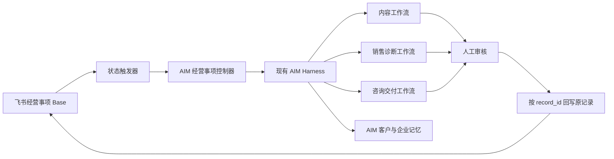

# 明动 AIM × 飞书 AI 原生公司升级执行计划

> 状态：执行中  
> 创建日期：2026-07-16  
> 业务负责人：李相宇  
> 架构、审查与验收：Codex（GPT-5.6 Sol）  
> 实现执行：Z-Code（统一使用 GLM-5.2）  
> 当前分支：`feat/aim-cognition-sprint1-2`

## 1. 目标

把明动 AIM 从“强内容生产工具”升级为三人团队可运行的 AI 原生经营系统：

```text
真实业务事项进入飞书
→ AIM 读取上下文并执行
→ 人只处理判断、审批和关键沟通
→ 结果回写原飞书记录
→ 客户、案例、内容、方法论和评估样本持续沉淀
```

90 天后，不以 Agent 数量或新增页面数量验收，而以以下五个闭环验收：

1. 内容能连接真实线索。
2. 线索能连接诊断与成交。
3. 成交能连接交付进度。
4. 交付能连接客户结果证据。
5. 结果能反哺案例、知识库和 AIM 评估集。

## 2. 当前判断

### 2.1 已经具备

AIM 当前已经不是简单文案工具，代码中已有：

- 客户项目与 IP 档案
- 知识库、Embedding 与上下文检索
- 商业诊断、定位、选题、文案、内容质检
- 发布登记、数据复盘、规则沉淀和运行快照
- AIM Harness 统一执行入口
- 飞书导入、导出、消息事件和 `lark-cli` 适配层
- 飞书单记录读取与按 `record_id` 原记录回写

因此不重做内容生产系统，不新建第二套 Agent 框架，不引入 Hermes，不在 AIM 内建设 CRM。

### 2.2 还不具备

当前仍缺少业务操作系统的核心闭环：

- 没有统一的“经营事项”状态契约。
- 飞书记录还不能稳定驱动 AIM 主流程。
- 执行结果、失败原因和人工审批没有形成同一条记录上的状态流转。
- 客户问题、成交、交付和内容结果之间仍未形成可追溯关系。
- 自动运行、失败恢复和经营级评估还不完整。

结论：AIM 是“内容资产操作系统雏形”，下一阶段要补经营控制面，而不是继续堆文案功能。

## 3. 从亦仁实践中采用和不采用的部分

参考：`2026-07-15-亦仁-近期对Agent的观察与实践-整理版.md`

### 采用

- Agent 必须进入真实生产线，而不是停留在聊天窗口。
- 飞书是团队业务入口和协作正本。
- 人负责定义问题、审美、标准和最终决策。
- 每个负责人对一个完整 Loop 的结果负责。
- Demo 先行，小步提交，高频验证。
- 模型、权限、上下文和 Harness 共同决定 Agent 质量。
- 是否能在人不盯着时稳定执行，是 Agent 化的重要标准。

### 暂不采用

- 不建设几十个或几百个 Agent。
- 不引入 Hermes 作为第二套运行时。
- 不建设 Agent 商城、复杂中台或多租户同步平台。
- 不让 Agent 无审批地发送客户承诺、报价或正式方案。
- 不在真实闭环未跑通前建设复杂仪表盘。

## 4. 正本边界

| 数据 | 正本 | 原则 |
|---|---|---|
| 线索、客户阶段、成交、回款 | 飞书 Base | 团队可见、可筛选、可协作 |
| 交付事项、负责人、期限、客户结果 | 飞书 Base | 一条经营事项一条记录 |
| 客户知识、IP 档案、方法论 | AIM | 进入生成和诊断上下文 |
| 选题、文案、诊断、质检、复盘规则 | AIM | 保留生成过程与版本 |
| AIM 结果摘要、结果链接、错误信息 | 回写飞书原记录 | 不新建平行结果表作为默认路径 |
| 运行轨迹、评估样本、失败样本 | AIM | 用于质量和回归验证 |

禁止双向任意同步。每类字段只允许一个系统作为写入正本，另一侧只保存引用或摘要。

## 5. 最小架构



架构约束：

- 保持现有模块化单体。
- AIM Harness 是唯一智能执行运行时。
- 飞书只通过现有 `lark-cli` 适配层接入。
- 所有外部数据在边界处收窄和校验。
- 所有状态转换必须幂等、可测试、可追踪。
- 不把业务状态逻辑堆进 `app/(dashboard)/aim/page.tsx`。

## 6. 三人团队 Loop

| Loop | 人类负责人 | AIM 执行 | 结果指标 |
|---|---|---|---|
| 内容增长 | Growth Owner | 客户问题提炼、选题、文案、复盘 | 有效线索数而非播放量 |
| 诊断成交 | CEO / 首席 IP | 线索诊断、会议准备、异议整理、跟进草稿 | 诊断率、成交率、回款 |
| 交付资产 | AI System Owner | 纪要、方案草稿、任务拆解、案例沉淀 | 交付周期、客户结果、复用率 |

暂不拆独立 Agent。只有数据权限、触发方式或评价标准明显不同，才拆新的 Agent 边界。

## 7. 飞书经营事项最小字段契约

真实建表前必须先用 `+field-list` 核对结构和字段类型。第一版只需要：

| 字段 | 类型建议 | 写入方 | 说明 |
|---|---|---|---|
| 事项名称 | 文本 | 人 / 飞书 | 人能看懂的任务名 |
| 状态 | 单选 | 人 + AIM | 状态机主字段 |
| 工作流 | 单选 | 人 / 飞书 | 内容、销售诊断、咨询交付 |
| AIM项目ID | 文本 | 人 / 系统 | 关联 AIM `ClientProject` |
| 输入内容 | 多行文本 | 人 / 飞书 | 任务原始上下文或会议链接 |
| AIM结果ID | 文本 | AIM | 关联生成或诊断结果 |
| 结果摘要 | 多行文本 | AIM | 便于团队在飞书直接查看 |
| 结果链接 | 超链接 | AIM | 回到 AIM 详情页 |
| 错误信息 | 多行文本 | AIM | 失败时保留可行动错误 |
| 负责人 | 人员 | 人 / 飞书 | 最终责任人 |
| 最后处理时间 | 日期时间 | AIM | 最近状态变化时间 |

状态机：

```text
待处理 → 处理中 → 待人工审核 → 已完成
                ↘ 失败 → 待处理
待人工审核 → 处理中（退回修改）
```

`已完成` 为终态。非法跳转必须拒绝，重复写入同一状态必须幂等返回。

## 8. 模型和协作协议

### Codex

负责：

- 读取真实代码、飞书结构与业务材料。
- 定义架构边界、状态契约和验收条件。
- 审查 Z-Code 的真实差异，不采信口头完成报告。
- 删除越界抽象，修复安全和类型问题。
- 运行测试、类型检查、架构护栏和静态检查。
- 每个完整工作包独立提交；没有明确 release commit 不部署。

### Z-Code / GLM-5.2

负责：

- 一次只执行一个工作包。
- 先读本计划、根 `AGENTS.md` 和涉及文件。
- 先写失败测试，再做最小实现。
- 不改计划外页面，不建第二套框架，不修改无关代码。
- 不提交 Git；由 Codex 审查后提交。
- 遇到真实 Base、权限或字段信息缺失时停止猜测并报告。

### 每个工作包的交接格式

Z-Code 完成后只报告：

1. 改动文件。
2. 测试命令与结果。
3. 未解决问题。
4. 是否偏离本计划。

## 9. 90 天路线

### 阶段 A：经营控制面（第 1—14 天）

目标：一条飞书记录能够驱动一次可追踪的 AIM 执行。

- WP-0：Z-Code GLM-5.2 无界面执行入口。
- WP-1：飞书单记录读取和原记录更新。
- WP-2：经营事项类型、字段解析和状态机。
- WP-3：经营事项执行服务，封装开始、待审、完成、失败。
- WP-4：受保护的 API 入口，根据 `record_id` 执行单条事项。
- WP-5：真实飞书 Base 字段核对、权限核对和一条记录联调。

阶段验收：同一记录完成 `待处理 → 处理中 → 待人工审核 → 已完成/失败`，且没有重复创建结果记录。

### 阶段 B：客户会后黄金工作流（第 15—30 天）

目标：先跑通最接近咨询收入的一条链路。

输入：飞书妙记、会议文本或客户沟通摘要。

输出：

- 客户痛点、目标、预算、决策阶段和异议
- 下一次跟进建议
- 咨询诊断问题清单
- 可转成短视频的真实选题
- 交付任务和负责人

人工审批后才允许进入正式客户沟通。

阶段验收：10 次真实客户会议中至少 8 次无需人工复制整理，且产物均能回溯到原会议和原记录。

### 阶段 C：三条业务工作流（第 31—60 天）

- 内容：客户问题 → 选题 → 文案 → 发布登记 → 数据复盘。
- 销售：线索 → 诊断 → 跟进 → 异议 → 成交结果。
- 交付：会议 → 方案 → 任务 → 周复盘 → 客户结果 → 案例。

三条工作流共用一个 AIM Harness、一个项目上下文体系和一套经营事项状态机。

阶段验收：内容、成交、交付之间通过项目ID、客户ID、结果ID和飞书记录ID形成可追踪链路。

### 阶段 D：企业记忆与无人值守（第 61—90 天）

- 自动提取客户原话、异议和成交触发点。
- 自动沉淀案例、方法论候选和失败样本。
- 增加定时扫描、失败恢复、超时提醒和人工接管。
- 建立最小评估集，防止模型或提示词升级导致质量退化。
- 最后才建设经营看板。

阶段验收：至少一个工作流能在无人盯守时运行，并在失败时留下可行动错误和人工接管入口。

## 10. 工作包清单

| 工作包 | 状态 | 产出 | 验收 |
|---|---|---|---|
| WP-0 GLM 执行通道 | 已完成 | `zcode-headless` 与真实路由验证 | 日志为 GLM-5.2 |
| WP-1 记录级 Base 能力 | 已完成 | `+record-get`、按 `record_id` 更新 | 单测、类型、架构检查通过 |
| WP-2 经营事项状态机 | 执行中 | 纯领域类型、解析、合法转换、字段 patch | 无外部依赖单测通过 |
| WP-3 经营事项执行服务 | 待执行 | 读取原记录、转换状态、失败回写 | 相同请求幂等 |
| WP-4 单条执行 API | 待执行 | 认证、输入校验、执行服务调用 | 未授权拒绝，错误不丢失 |
| WP-5 真实 Base 联调 | 等待 Base 链接 | 字段核对、权限核对、真实记录 | 原记录完整闭环 |
| WP-6 客户会后工作流 | 待执行 | 洞察、跟进、选题、交付任务 | 真实会议样本验收 |
| WP-7 资产沉淀 | 待执行 | 客户、案例、方法论、评估样本 | 可追溯且不混项目 |
| WP-8 无人值守 | 待执行 | 定时触发、恢复、提醒、人工接管 | 失败可恢复 |

## 11. 当前交给 Z-Code 的工作包：WP-2

### 目标

建立一个不依赖 UI、不依赖数据库、不执行真实飞书请求的“飞书经营事项”领域模块，作为后续所有工作流的状态控制核心。

### 实现范围

- 新建 `apps/web/src/lib/aim-feishu-work-item.ts`。
- 在现有集中式单元测试目录新增对应测试。
- 定义五种状态：`待处理`、`处理中`、`待人工审核`、`已完成`、`失败`。
- 解析飞书记录的最小字段：状态、工作流、AIM项目ID、输入内容、AIM结果ID、结果摘要、结果链接、错误信息。
- 定义合法状态转换并拒绝非法跳转。
- 重复转换到当前状态视为幂等，不报错。
- 提供开始处理、提交审核、完成、失败、重试所需的字段 patch 构造能力。
- patch 只返回可写存储字段，不包含公式、系统字段或推测字段。

### 不做

- 不调用 `lark-cli`。
- 不修改 `lark-base-tool.ts`。
- 不新增 API 路由。
- 不修改 AIM 页面和组件。
- 不新增数据库表。
- 不提交 Git。

### 验收

- 合法状态转换测试通过。
- 非法状态转换测试通过。
- 幂等转换测试通过。
- 飞书字段缺失和错误类型不会被静默伪造。
- 完成 patch 清空旧错误；失败 patch 不伪造结果ID。
- `pnpm --filter @mingyuan/web typecheck` 通过。
- 目标测试通过。
- `pnpm --filter @mingyuan/web arch:check` 通过。

## 12. 停止条件

出现以下情况必须停止继续扩建：

- 需要猜测真实飞书字段或字段类型。
- 需要新增第二套 Agent 运行时。
- 需要把经营状态写进 AIM 大页面。
- 无法说明新增模块对应哪个真实业务结果。
- 没有测试或真实样本证明当前工作包已完成。
- 工作区出现与当前工作包无关的用户改动。

## 13. 下一外部输入

WP-5 开始前，需要提供目标飞书多维表格链接。收到链接后必须：

1. 判断是 `/base/` 还是 `/wiki/` 链接。
2. Wiki 链接先解析真实 `obj_token`。
3. 串行读取表和字段结构。
4. 核对 bot/user 权限。
5. 只补缺失字段，不破坏现有表结构。
6. 用一条测试记录完成端到端联调。
