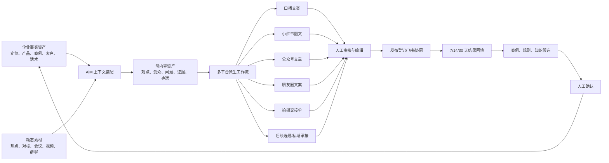

# 明动 AiM 内容资产经营系统升级计划

> 版本：v1.0  
> 制定日期：2026-07-23  
> 建议周期：60 天  
> 计划定位：承接现有「AI 原生公司升级计划」，补齐内容资产化主链，不替代现有发布、飞书经营事项和群聊采集计划。  
> 核心范围：企业知识资产 → 母内容 → 多平台派生 → 人工审核 → 发布协同 → 结果回流。

---

## 一、执行结论

明动 AiM 不需要再增加一批内容 Agent，也不需要重建知识库、工作流框架或团队协作平台。

本轮升级只解决四个已经明确存在的断点：

1. 用户拥有知识库，但看不清资料是否足以支撑稳定创作。
2. 系统已经提供「拆成多平台」入口，但部分链路仍只产出一种格式。
3. 内容可以生成、质检和登记发布，但缺少统一的「母内容—派生作品」关系。
4. 已有发布结果和 `ContentOutcome` 数据底座，但结果尚未稳定反哺知识库、方法和下一轮内容判断。

因此，60 天内把 AiM 从「具备内容经营功能」升级为「一条真实可用的内容资产经营主链」：

```text
企业资料与动态素材
→ 知识资产健康检查
→ 生成一份可追溯母内容
→ 派生多平台内容包
→ 人工审核与发布协同
→ 回填线索和成交结果
→ 人工确认后沉淀案例、规则和评估样本
```

### 北极星指标

**每一份真实母内容，能够被稳定复用为多平台发布物，并产生可追踪的业务结果。**

第一阶段不以生成字数、Agent 数量或内容数量为成功标准。

---

## 二、现状基线

### 2.1 已有能力，禁止重复建设

| 能力 | 当前基础 | 本轮处理 |
|---|---|---|
| 客户项目与 IP 档案 | 已有 `ClientProject`、IP Wiki、定位和人设链路 | 复用 |
| 企业知识库 | 已有 12 类知识、Embedding、上下文检索和项目隔离 | 不改底层分类 |
| 内容生产 | 已有选题、统一创作台、社媒速产、深度长文、朋友圈等模块 | 收口成母内容主链 |
| 多格式数据 | `AimGeneration` 已有口播、公众号、朋友圈、社群、拍摄单等字段 | 做实一次生成多格式 |
| 作品版本 | 已有 `AimContentVersion`、格式、版本号和父版本 | 复用派生与编辑版本 |
| 发布流程 | 已有草稿、待审核、待拍摄、剪辑中、待发布、已发布等状态 | 增加合法状态转换 |
| 发布事实 | 已有发布平台、链接和时间 | 补齐操作入口和校验 |
| 内容结果 | 已有 `ContentOutcome`、7/14/30 天回填和周复盘基础 | 接入主链 |
| 飞书协作 | 已有经营事项、人工审核和资产落地协议 | 作为团队协作正本 |
| 评估与追踪 | 已有 Harness、Trace、评估样本和质量门 | 增加内容包专项评估 |

### 2.2 当前主要差距

| 差距 | 用户表现 | 业务后果 |
|---|---|---|
| 知识库只有条目数，没有业务完整度 | 不知道还缺什么资料 | 生成质量波动，反复补信息 |
| 母内容没有统一结构 | 每个平台分别重新生成 | 观点、案例、CTA 容易漂移 |
| 多平台承诺未完全兑现 | 点「拆成多平台」仍可能只有一种结果 | 用户信任受损，复用效率低 |
| 派生关系不可见 | 不知道哪个作品来自哪份原稿 | 无法复盘“一份素材的总价值” |
| 工作流状态缺少强约束 | 状态可被任意跳转 | 发布事实和周复盘失真 |
| 发布结果回填依赖人工自觉 | 发布后不再回来 | 数据飞轮无法真实运转 |
| 团队分发没有最小闭环 | 内容生成后靠聊天转发 | 领取、责任和结果无法追踪 |

---

## 三、产品边界

### 3.1 本轮必须做

1. 五个用户可理解的知识资产盒子。
2. 知识资产健康度和缺失项提示。
3. 一份结构化、可追溯的母内容。
4. 一次任务生成多个真实可编辑格式。
5. 母内容、派生作品和编辑版本的可见关系。
6. 人工审核、发布登记和结果回填。
7. 结果生成资产候选，人工确认后回写知识库。
8. 针对真实内容包的回归评估和灰度指标。

### 3.2 本轮明确不做

1. 不新增独立 Agent。
2. 不建设第二套 Agent Runtime。
3. 不重构现有 12 类知识分类。
4. 不建设第二套 CRM、任务系统或飞书替代品。
5. 不做未经人工审核的全自动外部发布。
6. 不优先做播客、AI 短剧等低频格式。
7. 不建设复杂的员工矩阵、分佣和渠道结算平台。
8. 不因为这次升级顺手重构无关页面、Prompt 或基础设施。

---

## 四、目标产品架构



### 4.1 企业知识资产盒子

不修改底层 12 类知识，只增加前台聚合：

| 资产盒子 | 复用现有分类 | 用户要回答的问题 |
|---|---|---|
| 我是谁 | 老板经验、定位素材、写作风格 | 谁在表达，为什么值得听 |
| 我卖什么 | 产品卖点、交付说明 | 提供什么结果，适合谁 |
| 为什么相信我 | 项目案例、客户故事、过程证据 | 有什么真实证据 |
| 客户在想什么 | 客户痛点、客户问答、用户洞察 | 客户为什么犹豫和行动 |
| 我怎么承接 | 私域素材、销售话术、行动路径 | 内容之后让用户做什么 |

热点、对标和日常灵感放在「动态素材池」，不与企业事实混为一谈。

### 4.2 母内容最小契约

第一版把母内容结构保存在现有 `AimGeneration.taskSpec` 和生成内容中，不先新增数据库表。

```ts
interface CanonicalContentSpec {
  schemaVersion: 1
  coreMessage: string
  targetCustomer: string
  realProblem: string
  contentGoal: "曝光" | "信任" | "获客" | "成交"
  evidence: Array<{
    statement: string
    sourceType: "user_input" | "knowledge" | "meeting" | "benchmark" | "hot_topic"
    sourceId?: string
  }>
  personaAngle?: string
  productBridge?: string
  desiredAction: string
  mustKeep: string[]
  avoid: string[]
}
```

硬约束：

- 第一人称经历、客户案例、数字和结果必须可追溯。
- 动态素材不能覆盖企业事实。
- 多个平台版本共享同一个核心观点和事实证据。
- 平台可以改变结构、长度和表达，不能改变事实。
- 证据不足时标记「待补充」，不能为了完整而编造。

### 4.3 内容包最小契约

```ts
interface ContentPackageSpec {
  schemaVersion: 1
  canonicalGenerationId: string
  requestedFormats: ContentFormat[]
  completedFormats: ContentFormat[]
  failedFormats: Array<{
    format: ContentFormat
    reason: string
  }>
  knowledgeUsed: Array<{
    id: string
    title: string
    category: string
  }>
}
```

首批支持格式固定为：

1. `video_script`
2. `xiaohongshu_post`
3. `wechat_article`
4. `moments_post`
5. `shooting_brief`

社群文案、后续选题和私域承接可以继续使用现有 `raw_copy` 或 `community_message`，但不为它们新建独立系统。

### 4.4 工作流状态

沿用现有状态：

```text
draft
→ pending_review
→ ready_to_shoot / ready_to_publish
→ shooting
→ editing
→ ready_to_publish
→ published
→ archived
```

本轮增加确定性状态转换规则：

- `published` 必须同时填写发布平台和发布时间。
- 对外发布内容必须经过 `pending_review`。
- 视频内容可以走拍摄和剪辑状态，纯图文可以直接进入 `ready_to_publish`。
- 已发布作品不能回到草稿；修改必须创建新版本。
- 同一状态重复提交幂等返回。
- 归档不删除内容、版本、来源或结果。

---

## 五、60 天实施路线

## 阶段 0：锁定基线与评估样本（第 1—3 天）

### 目标

先证明现有多平台链路具体在哪里断，不凭印象重写。

### 工作包

#### WP0.1 发布基线

- 确认 `origin/main`、本地 HEAD 和生产 `releaseSha` 的关系。
- 当前工作树存在未提交改动，禁止直接在脏工作树中开发或部署本计划。
- 基于明确发布提交创建独立分支或 worktree。
- 不合并本轮以外的群聊采集、主题、转写或视觉改动。

#### WP0.2 真实样本集

准备 20 份真实输入：

- 5 份老板口述或访谈。
- 5 份已有深度文章。
- 5 份客户问题或会议洞察。
- 5 份热点/对标素材。

每份由人工标注：

- 正确核心观点。
- 必须保留事实。
- 禁止编造项。
- 适合的平台。
- 每个平台是否达到可发布标准。

#### WP0.3 当前失败分类

逐条跑现有「拆成多平台」，只使用二元结果：

- 是否产出了请求的全部格式。
- 核心观点是否一致。
- 事实是否一致。
- 是否出现虚构案例或数字。
- 是否符合平台形态。
- 是否可以通过最小修改发布。

### 验收

- 20 份样本全部有人工标准答案。
- 形成按频率排序的失败类型清单。
- 明确现有链路是 Prompt 问题、解析问题、持久化问题还是前端展示问题。
- 未写任何新功能前已有可重复基线。

---

## 阶段 1：知识资产健康度（第 4—10 天）

### 目标

让用户进入项目后能在 30 秒内看懂：哪些资料已经具备、哪些资料会影响内容质量。

### 工作包

#### WP1.1 五盒聚合

- 使用现有 12 类知识做确定性映射。
- 不改 `KnowledgeEntry.category`。
- 项目内显示五个资产盒子及条目数量。
- 点击盒子进入现有知识条目，不新建第二套录入页。

#### WP1.2 健康度规则

第一版不使用 LLM 自由打分，采用确定性检查：

- 是否存在定位。
- 是否存在产品卖点。
- 是否存在目标客户和客户痛点。
- 是否存在至少一个已确认案例或证据。
- 是否存在承接动作或私域话术。
- 是否存在写作风格或样本文案。
- 是否有 `pending_verify` 资料待审核。

显示结果：

- 已具备
- 待补充
- 待确认

不显示看似精确但没有业务意义的 83 分、91 分。

#### WP1.3 定向补资料

用户点击缺失项时：

- 跳转现有录入/上传入口。
- 给出 1—3 个具体问题。
- 只补当前缺口，不强迫完成冗长问卷。

### 验收

- 现有项目无需数据迁移即可看到五盒视图。
- 12 类知识全部有唯一映射或明确属于动态素材池。
- 健康度结果由确定性规则计算，重复运行一致。
- 项目间知识继续严格隔离。

---

## 阶段 2：母内容资产（第 11—21 天）

### 目标

每次正式多平台生成先冻结一份母内容，解决观点、证据和承接在不同平台之间漂移的问题。

### 工作包

#### WP2.1 母内容装配

- 复用 `TaskSpec`、项目资料、知识检索和用户当前输入。
- 确定性保存核心观点、受众、问题、目标、证据、CTA、禁区。
- 保存知识条目 ID，而不是只保存模型生成的摘要。
- 用户确认前可修改；确认后作为本次派生基准。

#### WP2.2 来源可视化

母内容界面显示：

- 当前输入
- 采用的知识
- 采用的会议/视频/热点/对标素材
- 尚缺的关键证据
- 模型假设

不显示完整内部 Prompt 或推理过程。

#### WP2.3 版本策略

- 初次确认保存为母内容 v1。
- 用户修改核心观点或事实时创建新版本。
- 只修改平台措辞不改变母内容。
- 恢复旧版通过创建新版本实现，不覆盖历史。

### 验收

- 20 份基线样本都能生成结构完整的母内容。
- 第一人称案例、数字和结果的无来源编造为 0。
- 用户可明确区分「企业事实」「动态素材」「模型假设」。
- 母内容修改有版本记录。

---

## 阶段 3：真正的一次生成多平台内容包（第 22—35 天）

### 目标

用户选择 2—5 个格式后，一次任务真实生成、保存并展示全部请求格式。

### 工作包

#### WP3.1 多格式编排

采用预定义工作流，不引入自主 Agent：

1. 读取已确认母内容。
2. 为每个平台装配独立平台约束。
3. 可并行生成不同格式。
4. 对每个格式单独解析、质检和保存。
5. 返回完成项与失败项。

部分格式失败时：

- 已成功格式仍然保存和展示。
- 失败格式显示可行动原因。
- 只重试失败格式，不重复消耗全部格式。

#### WP3.2 平台契约

每个平台只规定必要差异：

| 格式 | 主要约束 |
|---|---|
| 短视频口播 | 前 3 秒、口语、节奏、可拍摄、单一行动 |
| 小红书图文 | 标题、段落、可读性、收藏价值、平台风险 |
| 公众号文章 | 长文结构、小标题、证据展开、结尾承接 |
| 朋友圈文案 | 真人语气、场景、短段落、弱推销 |
| 拍摄交接单 | 镜头、场景、道具、重点句、补拍要求 |

不追求各平台字数完全一致，也不允许复制同一正文只换标题。

#### WP3.3 内容包界面

- 一个母内容对应一个内容包。
- 每个格式独立页签、独立版本、独立质检。
- 显示格式完成状态。
- 支持复制、编辑、重新生成单个格式。
- 不再把所有 `raw_copy` 统一显示为「诊断报告」。

#### WP3.4 成本和时延

- 记录每个格式使用的模型、Token、耗时和失败原因。
- 同一母内容的固定上下文尽量复用缓存。
- 并行数设置上限，避免一次选择五格式拖垮服务。
- 不为了降低成本而省略事实校验。

### 验收

- 用户选择 N 个格式时，成功响应中真实保存 N 个格式，或明确列出失败格式。
- 20 份样本的核心观点一致率达到 95% 以上。
- 请求格式完整率达到 95% 以上。
- 无来源事实编造为 0。
- 单个格式失败可以独立重试。
- 页面刷新后仍能恢复完整内容包和版本。

---

## 阶段 4：审核、发布与结果回流（第 36—49 天）

### 目标

内容从「生成完成」进入真实发布与复盘，不停在聊天结果里。

### 工作包

#### WP4.1 状态机收口

- 将合法状态转换集中为单一事实源。
- API 和前端引用同一规则。
- 非法跳转返回明确错误，不静默成功。
- 发布状态必须有发布平台。
- 已发布作品修改必须创建新版本。

#### WP4.2 发布包

为待发布作品生成：

- 最终正文。
- 标题/封面文字建议。
- 平台适配检查。
- 风险与最小修改建议。
- 素材清单或拍摄交接单。
- 发布平台和计划时间。
- 人工审核结论。

第一版只支持复制、导出和飞书协同，不自动向外部平台发布。

#### WP4.3 结果回填

发布后自动创建提醒：

- 第 7 天
- 第 14 天
- 第 30 天

优先采集业务结果：

- 合格评论
- 私信
- 加微
- 预约
- 有效线索
- 成交
- 收入

播放、点赞和收藏作为内容信号，不替代业务结果。

#### WP4.4 资产候选

系统根据真实结果生成候选：

- 成功案例
- 有效客户痛点
- 有效标题/开头规律
- 有效承接方式
- 无效内容警示

候选必须经过人工确认，AI 不直接改写正式知识库和方法论。

### 验收

- 每条已发布内容都有平台、时间和链接。
- 进入 `published` 后能生成 7/14/30 天提醒。
- 试点项目第 7 天结果回填率达到 80%。
- 每条沉淀规则都能追溯到具体内容和结果。
- 未经人工确认的候选不会进入正式知识库。

---

## 阶段 5：轻量团队分发与商业化试点（第 50—60 天）

### 目标

验证「总部生产、成员领取、结果回传」是否是真实需求，不先建设复杂企业平台。

### 工作包

#### WP5.1 飞书领取闭环

复用飞书经营事项：

- 内容包名称
- 项目
- 平台
- 领取人
- 截止时间
- 审核状态
- AiM 内容链接
- 发布链接
- 发布结果

AiM 保存内容和结果正本；飞书保存协作任务和负责人正本。

#### WP5.2 小规模试点

只选择：

- 1 个内部团队
- 1 个有门店、员工或合作伙伴分发需求的客户

每个试点最多 5—10 名成员，连续运行两周。

验证：

- 领取率
- 按时发布率
- 品牌一致性
- 发布回填率
- 是否真的减少总部沟通成本

#### WP5.3 商业化套餐

根据真实能力发布三档，不提前承诺未完成能力：

1. **基础版**：知识库、母内容、多平台内容包、质检、复盘。
2. **陪跑版**：知识库搭建、内容策略、定期复盘和实战社群。
3. **团队版试点**：飞书协同、成员领取、发布登记和团队结果。

全案拍摄、代运营、广告片等服务作为独立人工服务，不伪装成软件自动能力。

### 验收

- 两个试点都能完整走完领取、发布、回填。
- 没有出现项目间资料串线。
- 团队分发确实减少至少 30% 的重复沟通后，才进入正式企业版设计。
- 未达到验证标准则停止扩建组织、权限和分佣能力。

---

## 六、专项评估与上线闸门

### 6.1 内容包评估维度

全部使用二元判断，不使用模糊综合分：

| 维度 | 通过条件 |
|---|---|
| 格式完整 | 请求格式全部成功，或失败项被明确报告 |
| 观点一致 | 各平台版本没有改变母内容核心判断 |
| 事实一致 | 人物、数字、案例、产品信息没有漂移 |
| 来源可靠 | 关键事实能追溯到输入或知识条目 |
| 平台适配 | 不是同一篇正文机械复制 |
| CTA 一致 | 行动指令与内容目标一致 |
| 可编辑 | 每个格式可独立修改并保存版本 |
| 可恢复 | 刷新或重进页面可恢复完整内容包 |
| 可复盘 | 发布后能关联对应结果 |

### 6.2 发布门槛

每个工作包合并前必须通过：

- TypeScript 检查。
- 目标单元测试。
- 相关 API 契约测试。
- Prisma 查询边界和项目归属检查。
- 20 份专项样本回归。
- 虚构事实为 0。
- 现有确定性 Harness 不回退。
- 生产发布基于明确 commit，禁止 dirty deploy。

涉及并发多格式生成时，补充验证：

- 同一请求重复提交不产生重复内容包。
- 单格式重试不重复生成已成功格式。
- 任务超时后状态可恢复。
- 两个项目同时生成不会串知识。

---

## 七、核心指标

### 7.1 产品效率

| 指标 | 60 天目标 |
|---|---:|
| 从确认母内容到获得首个完整内容包的中位时间 | ≤ 8 分钟 |
| 请求格式完整率 | ≥ 95% |
| 内容包被用户至少编辑或复制一个格式的比例 | ≥ 70% |
| 单份母内容平均产生的有效发布格式 | ≥ 3 |
| 已发布内容第 7 天结果回填率 | ≥ 80% |

### 7.2 质量

| 指标 | 目标 |
|---|---:|
| 无来源第一人称案例/数字 | 0 |
| 核心观点跨平台一致率 | ≥ 95% |
| 人工仅需最小修改即可发布 | ≥ 80% |
| 项目间资料串线 | 0 |
| 用户要求格式漏产 | ≤ 5% |

### 7.3 业务结果

前 60 天只建立基线，不承诺绝对增长：

- 单份母内容带来的有效线索数。
- 不同内容目标的发布率。
- 从发布到私信、预约和成交的转化。
- 高播放低获客与低播放高成交内容的差异。
- 被重复调用的知识资产比例。

---

## 八、主要风险与处理

| 风险 | 早期信号 | 处理 |
|---|---|---|
| 再次扩大成新平台 | 开始讨论组织、分佣、渠道商城 | 回到两个试点，验证前不开发 |
| 多平台只是一次大 Prompt | 不同格式事实漂移、单项失败全失败 | 分格式工作流、独立解析和保存 |
| 母内容过重 | 用户每次都要填长表 | 从已有上下文自动装配，只确认关键项 |
| 健康度变成假评分 | 用户追求补齐数量而非有效资料 | 使用已具备/待补充/待确认 |
| 结果飞轮没有数据 | 发布后无人回填 | 7/14/30 天提醒，先抓业务结果 |
| 自动沉淀污染知识库 | 偶然爆款规则被永久采用 | 只生成候选，人工确认 |
| 成本和时延失控 | 五格式生成超过可接受时间或成本 | 限制并行、缓存固定上下文、单项重试 |
| 脏工作树混入发布 | releaseSha 无法对应变更 | 独立 worktree、明确 commit、发布闸门 |

---

## 九、实施顺序与依赖

```text
阶段 0 评估基线
   ↓
阶段 1 知识健康度 ─────────────┐
   ↓                           │
阶段 2 母内容资产              │
   ↓                           │
阶段 3 多平台内容包            │
   ↓                           │
阶段 4 发布与结果回流 ←────────┘
   ↓
阶段 5 团队分发试点
```

不可倒置的依赖：

- 没有母内容，不做批量派生。
- 没有完整内容包，不做团队分发。
- 没有发布事实，不做结果飞轮。
- 没有两个真实试点，不建设企业组织平台。

---

## 十、前 14 天立即行动清单

### 第 1—3 天

- [ ] 确认生产和代码正本。
- [ ] 创建隔离工作分支/worktree。
- [ ] 选定 20 份真实样本。
- [ ] 跑出现有多平台链路基线。
- [ ] 按频率完成失败类型排序。

### 第 4—7 天

- [ ] 完成 12 类知识到五盒视图的唯一映射。
- [ ] 定义知识健康度确定性规则。
- [ ] 完成五盒视图原型。
- [ ] 用 3 个真实项目验证缺失项是否符合业务判断。

### 第 8—10 天

- [ ] 接入现有知识列表和录入入口。
- [ ] 补项目隔离和待确认状态测试。
- [ ] 完成阶段 1 灰度验收。

### 第 11—14 天

- [ ] 冻结 `CanonicalContentSpec v1`。
- [ ] 复用 `TaskSpec` 保存母内容。
- [ ] 显示证据来源、假设和缺失信息。
- [ ] 用 5 份真实样本完成母内容端到端验证。

---

## 十一、最终验收场景

使用一个真实客户项目完成以下全链路：

1. 导入产品资料、案例、老板经历和客户问题。
2. 健康度指出一个真实缺口。
3. 补充缺口并生成一份母内容。
4. 人工确认核心观点、证据和行动指令。
5. 一次生成短视频、小红书、公众号、朋友圈和拍摄交接单。
6. 单独修改朋友圈版本，不影响其他格式和母内容。
7. 将短视频版本推进到待拍摄、剪辑、待发布和已发布。
8. 登记发布平台和链接。
9. 第 7 天回填私信、加微、预约和成交信息。
10. 系统生成一条案例候选和一条内容规律候选。
11. 人工确认后写入正确项目知识库。
12. 下一次创作能够检索并使用这条已确认资产。

只有以上 12 步在真实项目中全部跑通，才能宣告本轮升级完成。

---

## 十二、升级后的产品定位

### 内部产品定义

> 明动 AiM 是面向老板 IP 和企业品牌的内容资产经营智能体。它把产品、案例、客户问题和老板经验沉淀为可追溯的知识资产，并完成母内容生成、多平台派生、人工审核、发布协同和结果复盘。

### 对外短表达

> 把企业经验变成知识资产，把知识资产变成持续获客的内容。

---

## 十三、自动化推进清单（2026-07-23 代码侧）

> 仅记录**已落地的代码自动化**与**仍需人工**的边界；未完成能力不对外承诺。

### 已代码自动化

| 能力 | 说明 |
|---|---|
| `workflowStatus` 全链路回填 | history 映射 / generate 响应 / 状态下拉 / 推进后本地消息同步真实当前态 |
| 登记发布状态机 | 登记发布时自动 `ready_to_publish` → `published`（已有，保留） |
| 内容包完成后进待审核 | 请求格式全部完成且无失败时，自动 `draft` → `pending_review`（不跳过人工审核闸门） |
| 飞书领取一键创建 | 配置齐备时复用 `upsertBaseRecord` 写入经营事项表；以 `AIM结果ID` 幂等；成功后打开飞书记录 |
| 7/14/30 提醒扫描 | `outcome-flywheel` cron 每日扫描；监督通知启用时推飞书摘要 |
| AssetCandidate 最小审核入口 | 项目页挂「待审资产候选」：批准入库 / 仅批准 / 拒绝（复用现有 API） |

### 仍需人工 / 配置

| 项 | 原因 |
|---|---|
| 飞书经营事项表配置 | 缺 `LARK_BASE_TOKEN` / `LARK_WORK_ITEM_TABLE_ID` / `LARK_CLI_PATH` 时只能复制草稿，不伪造成功写入 |
| 领取人与截止时间 | 飞书侧负责人、截止日期仍需人工指定 |
| 对外正式发布 | 不自动外发到抖音/小红书等平台；须人工登记平台与链接 |
| 结果指标回填 | cron 只提醒，不代填业务数字；飞书推送依赖 `AIM_LOOP_NOTIFICATIONS_ENABLED` 等监督通知配置 |
| AssetCandidate → 知识库 | 必须人工批准；AI 不直写 KnowledgeEntry |
| 母内容确认 | 确认动作仍为人工闸门；确认后解锁多平台派生 UI |
| 试点与商业化验收 | WP5.2/5.3 依赖真实团队跑通，非代码可替代 |

### 明确未做（本轮禁止）

- 不新建 Agent、不新建 DB 表
- 不编造不存在的飞书 OpenAPI；只复用现有 `+record-upsert` / 经营事项字段契约
- 不把内容包自动推到 `ready_to_publish` / `published`（会破坏人工审核闸门）

