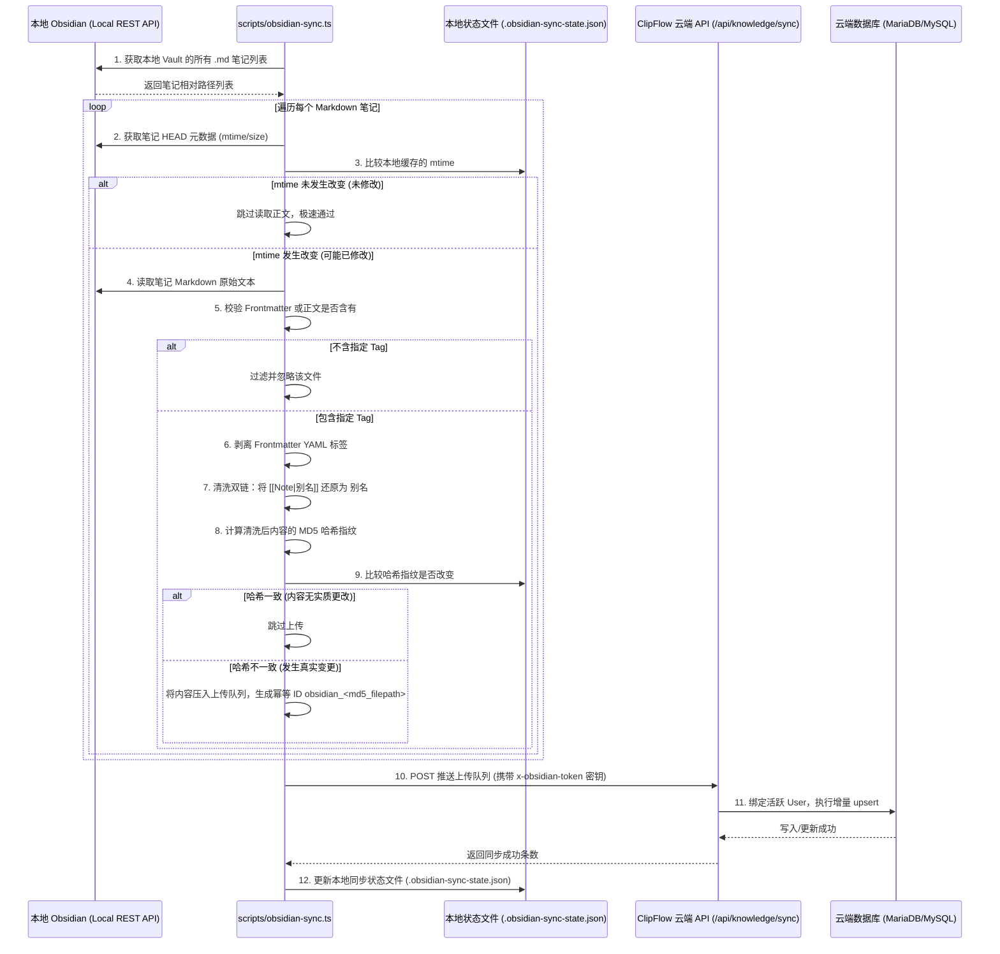

# 明远AIM 智能体平台：二期前沿资讯与本地双脑同步集成指南

本指南详细阐述了 明远AIM 智能体平台二期升级的核心架构、技术协议与集成流程。涵盖 **AI HOT 前沿精选融合**、**Obsidian 本地增量同步 CLI**，以及 **四维质量门控靶向局部精改** 三大系统的设计实现。

---

## 1. AI HOT 实时选题中心集成 (Phase 1)

AI HOT 前沿选题中心是 明远AIM 与外部高价值科技信源的智能融合点。通过从“数字生命卡兹克”精心提炼的 AI 资讯源中提取数据，为小企业主提供前沿选题的智能推荐。

### 1.1 云端 API 路由分流
- **服务端路由**：`/api/hot-topics?source=aihot`
- **逻辑分流**：
  当接收到 `source=aihot` 参数时，路由自动绕过传统的抖音热榜抓取，转而调用高性能的 `fetchAiHotSelectedItems()` 模块拉取最新的 AI HOT 资讯。
- **匹配与推荐**：
  抓取后的原始数据通过选题引擎，复用系统内部的“选题画像匹配算法”，根据用户的 IP 人设（Persona）自动生成切入角度和创意脑图。

### 1.2 高防伪与高性能网络机制
为了规避频限（Rate Limiting）以及 Nginx 403 UA 屏蔽限制，`aihot-client.ts` 实现了以下防封锁防御机制：
- **浏览器 UA 伪装**：
  伪装最新的 Chrome 124 浏览器 UA。
- **ETag 防频限缓存保障**：
  将数据请求的 ETag 值保存在 Redis 中。每次请求携带 `If-None-Match: <ETag>` 头。如果服务端返回 `304 Not Modified`，直接复用 Redis 缓存数据，大幅降低网络开销；如果 Redis 宕机，自动平滑降级为 In-Memory 缓存（ETag 与 Data 兜底）。
- **硬超时控制**：
  网络层注入 `AbortSignal.timeout(10000)`，杜绝无期限挂起，从根源上消除连接堆积和内存溢出。

---

## 2. Obsidian 本地知识库双脑增量同步 (Phase 2)

Obsidian 本地双脑同步系统实现了将用户的“本地第二大脑”与“ClipFlow 云端智能体大脑”增量互通。

### 2.1 架构示意与数据流



### 2.2 本地 CLI 同步脚本
- **执行命令**：
  ```bash
  # 增量推送变更笔记
  pnpm tsx scripts/obsidian-sync.ts
  
  # 强制全量推送（无视本地指纹状态）
  pnpm tsx scripts/obsidian-sync.ts --force
  ```
- **证书安全性**：
  由于 Obsidian Local REST API 采用本地自签名 HTTPS 证书，脚本内置了 `process.env.NODE_TLS_REJECT_UNAUTHORIZED = "0"`，完美避开了 Node.js 自签名 TLS 证书握手失败的拦截警告。
- **自动初始化**：
  首次在根目录运行该脚本时，若找不到 `.obsidian-sync.json` 配置文件，会自动生成一份空模板并以退出码 `1` 退出，给出友好的操作向导。

### 2.3 云端同步接口与安全校验
- **接口路径**：`POST /api/knowledge/sync`
- **安全验证**：
  客户端请求头必须携带 `x-obsidian-token`。服务端使用环境变量 `OBSIDIAN_SYNC_TOKEN`（默认值为 `clipflow-obsidian-sync-secret`）进行强等值判定。
- **Prisma 零 Mock 落库保障**：
  接口内部使用 `prisma.knowledgeEntry.upsert` 进行底层 upsert 写入。如果客户端未显示指定 `userId`，则在服务端自动关联系统中的第一个 User 以提供稳健的归属绑定。

---

## 3. 四维质量门控“靶向局部精改”机制 (Phase 3)

质量审查门控是保障生成文案达到生产级可用、零 AI 腔调、高可读性的核心质量防御系统。

### 3.1 质量门控打分基准
文案在发布之前，必须自动通过以下四大维度的量化判定（满分 10 分）：

| 维度 | 及格线 | 核心检测指标 | 不及格时的改写机制 |
| --- | --- | --- | --- |
| **editorial** (编辑质量) | **7 分** | 整体结构完整性、口播流畅度、是否高度切合 IP 人设 | 调用 `EDITORIAL_REWRITE_PROMPT` 人设与编辑质量靶向精修 |
| **aiTaste** (AI味特征) | **6 分** | 扫描 93 个禁词词库、消除套路化排比与八股官腔句式 | 调用 `ORAL_REWRITE_PROMPT` 口语去油精修，剔除黑话 |
| **attraction** (吸引力) | **7 分** | 前 3 秒钩子（Hook）强度、悬念设置、完播率预估 | 调用 `HOOK_REWRITE_PROMPT` 靶向开头 3 秒重构，保留正文 |
| **logic** (逻辑一致性) | **7 分** | 文案与选题、结构、叙事节拍是否高度一致，论点论据匹配 | 调用 `LOGIC_REWRITE_PROMPT` 靶向中段论证逻辑链重构 |

### 3.2 靶向控制流设计 (木桶短板消灭法)
- **不及格拦截**：四维度中若有任何一个低于及格线，即会拦截发布，自动启动重写控制流（上限为 3 次，防止死循环）。
- **Gap 差距计算**：
  系统在每一轮打分后计算未及格维度与及格线的最大差距：
  $$\text{Gap} = \text{Pass Score} - \text{Current Score}$$
- **焦点锁定**：系统**挑选 Gap 最大的那个木桶短板作为本次重写的唯一焦点（Target Focus）**，分派给上述对应的四大专属子 Agent 执行高精度精修。
- **测试指令**：
  在 `mingyuan/apps/web` 下执行以下命令可进行四维及格与四大改写 prompt 的闭环断言测试：
  ```bash
  npx vitest run __tests__/unit/quality-gate.test.ts
  ```

---

## 4. 生产环境部署与运维 (Runbook)

### 4.1 环境变量配置
在 `mingyuan/apps/web/.env` 文件中配置以下变量：
```bash
# Obsidian 双脑同步云端鉴权密钥 (需与本地配置文件一致)
OBSIDIAN_SYNC_TOKEN="your-secure-obsidian-sync-secret-key"
```

### 4.2 本地 CLI 运行先决条件
1. 在 Obsidian 安装社区插件 `Local REST API` 并开启 HTTPS。
2. 从插件设置中复制 API Token。
3. 在项目根目录生成的 `.obsidian-sync.json` 中配置：
   ```json
   {
     "obsidianApiUrl": "https://127.0.0.1:27124",
     "obsidianToken": "你的Obsidian_REST_API_Token",
     "targetServerUrl": "http://localhost:3000",
     "syncToken": "your-secure-obsidian-sync-secret-key",
     "syncTag": "Aim/知识库"
   }
   ```
4. 运行 `pnpm tsx scripts/obsidian-sync.ts` 开始双脑互联。
