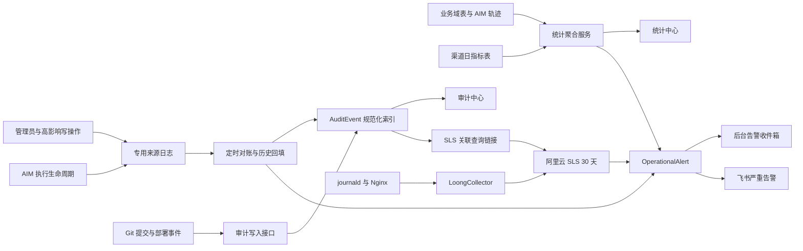

# 统一统计中心与审计中心设计

**日期：** 2026-09-10

**状态：** 待产品负责人评审

**范围：** 明动 AIM 内部生产级控制中心

**不含：** 法律取证级 WORM、跨组织合规归档、外部客户自助报表

## 1. 目标与成功标准

本升级把当前分散的运行数据、业务结果、管理员操作、AIM 执行轨迹、代码提交和服务器日志统一到一套可查询、可关联、可告警的内部控制体系中，但不把不同性质的数据强行塞进同一张表或同一个页面。

上线后的成功标准：

1. 管理员可以从独立的“统计中心”同时看到运营健康与业务结果，并明确知道数据时间范围、时区、新鲜度和覆盖率。
2. 管理员可以从独立的“审计中心”查询所有纳入范围的控制面变更，追溯操作者、对象、结果、来源记录和关联日志。
3. 所有 `/api/admin` 写接口要么通过统一审计封装记录，要么在清单中声明有理由的豁免；新增未覆盖写接口会被测试阻止。
4. AIM 执行、管理员操作、Git 提交、部署与运行时日志通过 `correlationId`、`requestId`、`traceId`、`sourceRecordId` 或 `gitSha` 建立关联。
5. 严重问题进入后台告警收件箱，并通过现有飞书通知能力发送；重复告警被去重，告警状态变化自身也被审计。
6. 阿里云 ECS 的应用与 Nginx 日志进入 SLS，原始日志保留 30 天；规范化审计索引和日级渠道指标保留 180 天。
7. 查询失败、数据源降级或数据不完整时显示“不可用/数据不足”，不得伪装成 0。

## 2. 已验证现状与主要缺口

现有系统已经具备 `AuditEvent`、内部审计写入接口、审计查询接口、对账接口、审计中心页面、AIM 执行轨迹、管理员专用日志和飞书通知能力，因此本次采用增量升级，不重建第二套平行基础设施。

评审时确认的主要缺口：

- 审计覆盖不完整：抽样静态扫描中，24 个管理员鉴权写路由文件只有 5 个显式调用管理员审计记录。
- 对账接口未被生产定时器调度，也没有持久化高水位游标；直接写入失败后无法稳定补偿。
- 对账状态映射会把非失败状态一律视为成功，可能把 `running` 错写为成功。
- 审计页顶部失败数、严重数和来源数来自当前最多 50 行，而不是完整过滤结果。
- 审计详情没有完整展示来源记录、幂等键和 SLS 跳转，关联链只显示有限条目。
- 脱敏仅依赖键名黑名单，无法可靠约束摘要、外部链接和变体字段。
- 相同幂等键但不同载荷没有冲突检测，且重复写入仍可能报告为“已插入”。
- `/admin/usage` 只是跳转页，现有运营指标和渠道指标接口没有形成统一统计页面。
- 渠道统计存在时区、桶边界、Redis 留存与失败归零问题。
- `/api/metrics` 当前可匿名访问，部分声明指标没有真实调用点。
- 阿里云 ECS 已有持久化 journald，但没有安装或运行 LoongCollector，应用日志尚未进入 SLS。
- 规范化审计索引没有明确清理策略。

历史数据存在缺口是已知事实：评审快照中 671 条 AIM 执行轨迹只有 223 条已有关联审计索引。补齐流程必须记录覆盖率与不可补字段，不能把历史回填描述成原始完整证据。

## 3. 产品结构

### 3.1 页面边界

- `/admin/statistics`：统计中心，回答“系统运行得怎样、业务结果怎样”。
- `/admin/audit-center`：审计中心，回答“谁在什么时候对什么做了什么、结果如何、证据在哪里”。
- `/admin`：保留精简工作台，只展示关键摘要与待处理告警，并链接到两个中心。

兼容入口：

- `/admin/usage` → `/admin/statistics?section=cost`
- `/admin/agents` → `/admin/statistics?section=executions`
- `/admin/logs` → `/admin/audit-center`

### 3.2 首屏信息结构

统计中心默认显示最近 7 天，首屏左右并列：

- 运营侧：执行量、成功率、失败量、超时运行、时延、Token、成本、数据覆盖率。
- 业务侧：发布数、合格线索、预约、成交、收入/回款、首稿通过率、重写率、人工接管与 P0/P1 故障。

下方展示日趋势、渠道拆分、与上一等长周期对比。每个卡片必须显示口径提示；数据不完整时显示覆盖率或“数据不足”。异常卡片可直接跳转到带过滤条件的审计中心。

审计中心首屏显示完整过滤范围内的总数、失败数、严重数和来源数，下方使用游标分页的事件列表。详情抽屉展示来源记录、幂等键、关联链、外部日志入口和安全元数据。

## 4. 总体架构



架构原则：

- 业务域表和专用日志仍是事实源；`AuditEvent` 是规范化、可检索的追加型索引，不替代原始来源。
- 统计中心从业务事实计算，不从 `AuditEvent` 反推经营结果。
- Redis 只承担低延迟运行计数，不作为长期管理报表的唯一来源。
- SLS 保存原始运行日志，数据库保存结构化索引与管理状态；数据库中不复制整段原始日志。

## 5. 统一时间与数据语义

- 管理页面统一使用 `Asia/Shanghai`。
- 默认周期为最近 7 个完整自然日加当前日；提供 1、7、30 天预设，自定义范围最多 31 天。
- 同比为紧邻当前范围之前的等长周期。
- API 以明确的 `from`、`to` 日期返回实际起止时间与时区，不依赖服务器本地午夜。
- `0` 只表示数据源成功查询后的真实零值。
- 查询失败返回降级状态；未采集、样本不足或历史无法补齐返回 `null` 和原因。
- 收入与回款分别展示，不允许互相替代。

## 6. 审计数据设计

### 6.1 AuditEvent

保留现有 `AuditEvent`，补齐以下语义：

- `eventType`：稳定动作名，例如 `knowledge.entry.updated`。
- `status`：`started | success | failed`。
- `severity`：`info | warning | error | critical`。
- `actorType` 与 `actorIdHash`：只保存经校验的主体类型和不可逆标识。
- `targetType` 与 `targetId`：被操作资源的安全标识。
- `correlationId`、`requestId`、`traceId`、`gitSha`：跨系统关联字段。
- `sourceRecordType`、`sourceRecordId`：指向来源事实记录。
- `idempotencyKey`：事件幂等边界。
- `payloadHash`：规范化安全载荷的哈希，用于识别幂等冲突。
- `summary`：有限长度、无原文内容的可读摘要。
- `metadata`：按事件来源白名单过滤的安全字段。
- `occurredAt`、`ingestedAt`：事件发生时间与进入索引时间。

幂等规则：

- 新键：插入并返回 `inserted: true`。
- 相同键且 `payloadHash` 相同：不重复插入，返回 `inserted: false`。
- 相同键但 `payloadHash` 不同：返回 409，生成 `critical` 告警，不覆盖原事件。

### 6.2 专用来源日志

`AdminAuditLog` 增加 `status`、`severity`、`correlationId`，从而表达开始、成功和失败，而不只记录成功后的操作。

写入必须拆成两个边界：

1. 与业务变更处于同一数据库事务中的专用来源日志，保证事务失败时不会留下“已成功变更”的假记录。
2. 事务提交后的规范化索引写入；若索引写入失败，由持久化对账游标补偿。

统一封装：

```ts
runAuditedAdminMutation({
  request,
  admin,
  action,
  target,
  safeMetadata,
  mutate: async (tx) => { /* business mutation */ },
})
```

封装负责主体解析、事务内来源日志、错误状态、关联 ID 和提交后索引，不允许每个路由各自拼接审计载荷。

### 6.3 纳入范围

必须审计：

- 所有管理员/编辑者控制面写操作，包括知识库、模板、基准配置、AIM 自定义技能、热门来源和系统设置。
- 用户数据、权限、发布、删除等高影响业务动作。
- AIM 执行的 `started`、`success`、`failed` 生命周期。
- 仓库 Git 提交、生产部署开始/完成/失败和关键运行时变更。
- 告警确认、解决、重开等状态变化。

不纳入正文内容：

- 普通聊天消息和生成内容不作为审计事件正文保存。
- 未提交的本地文件编辑不承诺形成永久仓库审计；Git commit 是仓库变更的稳定审计边界。
- 密码、Token、Cookie、环境变量值、完整请求/响应、知识正文、聊天正文不得进入审计元数据。

建立管理员写接口清单测试：扫描 `/api/admin` 下的 `POST/PUT/PATCH/DELETE`，要求每个路由使用统一封装或在显式豁免清单中写明原因。豁免仅允许登录、会话维护和无业务变更的探针接口。

## 7. 对账、回填与数据质量

新增 `AuditReconcileCheckpoint`，按来源保存：

- 正向高水位：持续补齐新发生但未索引的来源记录。
- 历史回填游标：分批向过去扫描历史数据。
- 最近成功时间、最近错误和处理数量。

生产对账每 5 分钟运行一次。状态必须精确映射：

- `running` → `started`
- `success` → `success`
- `failed` → `failed`
- 未识别状态 → 跳过并产生 warning，不得默认成功

回填采用小批次、幂等写入，不阻塞在线请求。历史缺失字段保持 `null`，并在统计和审计页面展示覆盖率。对账延迟超过 10 分钟触发告警。

## 8. 审计查询接口与页面

### 8.1 接口

- `GET /api/admin/audit-events`：游标分页列表，支持时间、状态、严重级别、来源、动作、主体、目标和关联 ID 过滤。
- `GET /api/admin/audit-events/summary`：使用与列表完全相同的过滤条件，返回全量总数、失败数、严重数、来源数和时间范围。
- `GET /api/admin/audit-events/:id`：返回安全详情、来源引用和关联查询入口。
- `GET /api/admin/audit-events/:id/related`：游标分页返回完整关联链。

默认查询当天，最大单次范围 31 天。列表和汇总共享同一个解析器，防止过滤口径漂移。

### 8.2 SLS 跳转

前端不接受外部 URL 作为事件输入。服务端根据可信配置生成 SLS 控制台链接，以事件时间前后 5 分钟和可用的 `correlationId`、`requestId`、`traceId` 或 `gitSha` 构造查询。配置不完整时隐藏入口，不生成半有效链接。

## 9. 统计中心数据设计

### 9.1 接口契约

```http
GET /api/admin/statistics/overview
  ?from=2026-09-04
  &to=2026-09-10
  &projectId=...
  &agentId=...
  &channel=...
```

返回：

- `period`：实际起止、时区、比较周期。
- `freshness`：各来源最后更新时间、延迟和降级原因。
- `operations`：执行、成功、失败、运行超时、成功率、p50/p95 时延、Token、成本、覆盖率。
- `business`：发布、合格线索、预约、成交、收入、回款、质量率、人工接管、P0/P1。
- `channels`：各平台的日级指标和合计。
- `dailyTrend`：统一日期桶的日趋势。
- `comparison`：与上一等长周期的绝对变化和变化率。
- `coverage`：每项指标的可计算样本数、总样本数和缺失原因。

### 9.2 业务指标复用

复用现有 `ReviewMetricsSnapshot` 和 `loadReviewMetricsSnapshot` 的业务定义，抽取共享查询能力，避免统计页面另写一套公式。包括：

- 发布数、合格线索、预约、成交。
- 收入、回款次数和回款金额。
- 客户结果数、节省时间。
- 首稿通过率、重写率、拒绝率。
- 单次成功直接成本、完全成本。
- P0/P1 故障、人工接管、高成本异常。
- 7 日回填率、动作闭环率和覆盖率。

### 9.3 渠道日指标

新增 `ChannelMetricDaily` 持久表：

- `day`：上海时区自然日。
- `platform`：低基数渠道枚举。
- `metric`：受控指标枚举。
- `count`：日累计值。
- 唯一键：`day + platform + metric`。

Redis 继续承担实时增量，后台任务将增量可靠落入日表。统计中心读取数据库；没有指定平台时聚合所有平台。Redis 故障必须报告降级，不能返回看似正常的全零结果。该表保留 180 天。

## 10. 告警中心与飞书通知

新增 `OperationalAlert`：

- 状态：`open | acknowledged | resolved`。
- 级别：`warning | error | critical`。
- `fingerprint`：同类问题去重键。
- `firstSeenAt`、`lastSeenAt`、`occurrenceCount`。
- 安全摘要、来源、关联 ID 和处理人。

默认规则：

- 审计对账延迟超过 10 分钟：error。
- 连续 3 次健康检查失败：error。
- SLS 采集心跳延迟超过 10 分钟：error。
- 最近 30 分钟 AIM 运行不少于 10 次且失败率不低于 20%：error。
- 审计幂等键载荷冲突：critical。

warning 只进入后台收件箱；error 和 critical 复用现有飞书 supervisor notifier 发送 `system_alert`。同一 fingerprint 的飞书通知至少间隔 15 分钟；恢复时发送一次恢复通知。告警确认与解决必须写入审计日志。

## 11. Prometheus 指标安全化

- `/api/metrics` 要求 `Authorization: Bearer <METRICS_SCRAPE_SECRET>`。
- Secret 至少 32 字符，只存生产环境，不写入仓库和日志。
- 未授权返回 401，响应不透露配置状态。
- 移除或停止宣传没有真实调用点的 HTTP/外部调用计数器。
- 只增加并实际更新以下指标：审计写入失败数、幂等冲突数、对账延迟、统计查询失败数、渠道落库失败数、SLS 采集心跳延迟。
- 同步修订 K8s/运维采集文档，确保抓取配置携带认证头。

## 12. 阿里云 SLS 正式接入

目标配置：

- SLS Project：`mingyuan-prod-observability`
- Logstore：`app-journal`、`nginx-access`
- 原始日志保留：30 天
- 采集器：LoongCollector

实施时必须先在阿里云账号中确认地域、Project 名称可用性和权限，再创建资源。ECS 采集范围：

- `mingyuan-web.service`
- 后台任务、审计对账和留存清理相关 timer/service
- Nginx access/error 日志

解析字段包括 journald 基础字段，以及应用 JSON 消息中的 `requestId`、`correlationId`、`traceId`、`component`、`status`、`duration`、`releaseSha`。禁止采集 `/etc/mingyuan.env`，禁止在仓库或日志中保存 SLS 凭证。

发布顺序为单服务 canary → 验证采集延迟、字段解析和脱敏 → 扩展到全部目标。SLS 心跳进入告警规则。

## 13. 留存与清理

- `AuditEvent`：180 天。
- `ChannelMetricDaily`：180 天。
- SLS 原始日志：30 天。
- 专用来源日志：本阶段不删除，不改变其现有留存。

数据库清理任务每天 03:30（Asia/Shanghai）执行，每批最多 1000 条、每次最多 20 批，避免长事务。上线后前 7 天只报告预计删除量，不执行删除；确认数量和边界无误并获得生产执行批准后，才启用真实删除。

## 14. 安全与脱敏

- 按事件类型和来源定义允许字段白名单，未知字段直接丢弃。
- `summary`、ID、枚举和 URL 分别做长度、字符集和协议校验。
- 主体标识使用服务端 HMAC/哈希策略，外部调用方不能直接指定可信哈希结果。
- 审计接口继续使用时间戳、nonce、HMAC 和重放保护；密钥轮换支持双密钥短暂过渡。
- SLS 跳转仅由服务端可信配置生成。
- 管理 API 和页面保持管理员鉴权，错误响应不得返回原始载荷。

## 15. 开关、回滚与兼容

使用最少开关：

- `ADMIN_CONTROL_CENTERS_ENABLED`：控制新统计/审计入口和页面。
- `AUDIT_RECONCILE_ENABLED`：控制定时对账与回填。
- `AUDIT_ALERT_NOTIFICATIONS_ENABLED`：控制飞书告警发送，不影响后台告警入库。

SLS 链接由完整配置自动启用，不增加独立开关。数据库变更全部为增量式；应用回滚时关闭页面和任务开关即可，原专用日志和现有业务流程继续工作。禁止以删除新表作为紧急回滚步骤。

## 16. 分阶段交付

1. **数据契约与安全底座**：schema、迁移、类型、时间口径、脱敏白名单、幂等冲突和单元测试。
2. **审计覆盖**：统一管理员写操作封装、路由清单、核心写路径接入、失败状态审计。
3. **对账与历史回填**：持久化 checkpoint、5 分钟调度、影子运行、覆盖率报告。
4. **统计 API 与页面**：复用业务指标、持久化渠道日表、首屏双栏和数据质量提示。
5. **后台告警与飞书**：先验证收件箱与状态流转，再开启 error/critical 飞书通知。
6. **Prometheus 加固**：抓取认证、真实指标调用点和运维文档。
7. **SLS canary 与全量采集**：验证字段、脱敏、延迟、链接和心跳告警后扩大范围。
8. **留存执行**：先 7 天 report-only，再经生产批准开启数据库删除。
9. **生产发布验证**：从干净 commit 部署，验证页面、接口、对账、告警、SLS 和回滚开关。

每阶段独立提交、可单独回滚；涉及生产配置、SLS 资源、systemd/timer 或真实删除时，需要单独的生产执行批准。

## 17. 测试与验收

### 17.1 自动化测试

- 审计写入：签名、nonce、防重放、白名单脱敏、相同幂等载荷、冲突载荷。
- 管理员变更：事务成功、业务回滚、索引失败后的对账恢复。
- 路由清单：所有管理员写接口均已覆盖或有明确豁免。
- 对账：三种状态精确映射、未知状态、断点续跑、重复执行、历史空字段。
- 统计：上海日期边界、1/7/30 天、上一周期、零值、null、降级、覆盖率。
- 渠道：无平台聚合、Redis 故障、跨日落库和 180 天边界。
- 页面：汇总来自完整过滤结果、详情字段、关联分页、数据不足状态和跳转过滤。
- 告警：阈值、fingerprint 去重、15 分钟抑制、恢复、状态审计。
- Metrics：匿名 401、错误 Token 401、正确 Token 200。

### 17.2 生产验收

1. 选择一个低风险管理员变更，确认专用来源日志和 `AuditEvent` 都存在且关联一致。
2. 人为阻断一次索引写入，确认 5 分钟对账可以恢复且不重复。
3. 抽查 `running/success/failed` 映射，不存在运行中被标记成功。
4. 统计中心同一周期的执行数、成交数和回款数与来源查询一致。
5. 关闭一个统计来源，页面显示降级/数据不足而不是 0。
6. 触发测试 error 告警，确认后台入箱、飞书去重、确认/解决和审计闭环。
7. 确认未认证 `/api/metrics` 返回 401。
8. 在 SLS 中按关联 ID 找到 canary 服务日志，字段可检索且没有敏感内容。
9. 留存任务 report-only 数量经过人工复核；没有删除专用来源日志。
10. 关闭三个功能开关，确认旧业务路径继续可用。

## 18. 明确不做

- 本阶段不建设法律取证级不可篡改存储和电子证据链。
- 不保存聊天正文、知识正文或完整请求响应作为审计材料。
- 不把 AuditEvent 当作财务、成交或运营指标事实源。
- 不引入第二套飞书机器人或第二套告警基础设施。
- 不一次性删除历史日志，不对历史缺失数据做推测性补全。
- 不在本设计阶段修改生产 systemd、SLS、数据库或部署配置。

## 19. 评审结论要求

产品负责人评审本设计时只需确认三件事：

1. 两个独立中心的产品边界是否符合管理习惯。
2. 必须审计的行为范围是否需要增加或排除某类动作。
3. 默认告警阈值是否适合当前业务量。

设计获批后，再编写逐文件、逐测试、逐提交的实施计划；实施计划不得把本设计中的生产动作视为已经获批。
